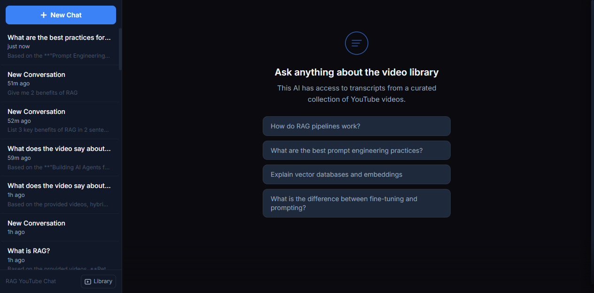

# AI Tutor

A production RAG chat application — ask questions about a creator's video catalog and get streaming, **cited** answers that deep-link to the exact timestamp in the source video.

This repository is the **running project for the Dynamous Agentic Engineering Course**. Across the course you onboard onto this codebase, plan an epic against it, and ship real features using the PIV loop (Plan → Implement → Validate). It is a genuine production application deployed at `chat.dynamous.ai` — real features, real bugs, real architectural decisions — not a toy demo.

> The application is internally named **DynaChat** (you'll see `dynachat` in config and deploy files). Throughout the course it is referred to as **the AI Tutor**. Same application.



---

## What it does

1. **Ingest** — content sources are chunked with Docling's `HybridChunker` and embedded via OpenRouter. Two ingestion paths exist today: YouTube transcripts (fetched via Supadata) and paid Dynamous course transcripts (parsed from markdown).
2. **Sync** — `POST /api/channels/sync` enumerates and ingests new videos from a YouTube channel automatically.
3. **Retrieve** — user queries run through **Reciprocal Rank Fusion (RRF)**: Postgres `tsvector` full-text search combined with `pgvector` cosine similarity, top-5 chunks.
4. **Generate** — retrieved chunks are passed to Claude (via OpenRouter), which streams a cited response over Server-Sent Events. Every citation carries the video title, link, exact-timestamp deep-link, and the quoted transcript snippet.

---

## Architecture

```
┌─────────────────┐       /api proxy        ┌─────────────────────────┐
│    Frontend     │ ─────────────────────── │        Backend          │
│  React + Vite   │    localhost:5173 →     │       FastAPI           │
│  TypeScript     │        :8000            │                         │
│  Tailwind CSS   │                         │  Routes ── RAG Pipeline │
└─────────────────┘                         │    │        │           │
                                            │    │     Chunker        │
                                            │    │     (Docling)      │
                                            │    │        │           │
                                            │    DB    Embeddings     │
                                            │(Postgres) (OpenRouter)  │
                                            │            │            │
                                            │         Retriever       │
                                            │  (RRF hybrid: tsvector   │
                                            │   + pgvector cosine)     │
                                            │            │            │
                                            │           LLM           │
                                            │    (Claude via          │
                                            │     OpenRouter)         │
                                            └─────────────────────────┘
```

- **Frontend:** React 18 + Vite + TypeScript + Tailwind CSS (Bun)
- **Backend:** Python + FastAPI, single process handling API + RAG + LLM
- **Database:** Postgres via `asyncpg`, with `pgvector` for hybrid retrieval; schema managed by Alembic migrations
- **Auth:** Google OAuth + email/password sign-in, JWT session cookies
- **LLM:** Claude Sonnet via OpenRouter, SSE streaming
- **Embeddings:** `text-embedding-3-small` via OpenRouter (1536-dim)
- **Chunking:** Docling `HybridChunker` (512-token target)
- **Retrieval:** RRF hybrid (tsvector keyword + pgvector cosine), top-5 chunks

For full code conventions, repo layout, and the rules AI coding agents should follow in this codebase, see [`CLAUDE.md`](CLAUDE.md).

---

## Quick Start

### Docker + just (recommended for local development)

This is the simplest local setup. It starts Postgres and `app-blue`, serves the
built frontend through FastAPI on `http://localhost:8000`, and does not start
the production Caddy or blue/green standby service.

Prerequisites:

- [Docker Desktop](https://docs.docker.com/desktop/)
- [`just`](https://just.systems/man/en/)
- An [OpenRouter](https://openrouter.ai) API key for chat and embeddings

Create the local environment file and fill in the required values:

```powershell
Copy-Item deploy\.env.example deploy\.env
```

Create `deploy/docker-compose.local.yml` with the local port and demo seed:

```yaml
services:
  app-blue:
    ports:
      - "8000:8000"
    environment:
      SEED_ENABLE: "true"
```

From repository root:

```bash
just dev-up-build
```

Open <http://localhost:8000>. Subsequent starts can use `just dev-up`. Stop
containers without deleting database data with `just dev-down`.

### Prerequisites

- Python 3.11+ and [`uv`](https://docs.astral.sh/uv/)
- [Bun](https://bun.sh)
- A Postgres database with the `pgvector` extension (the simplest local option is the `postgres` service in [`deploy/docker-compose.yml`](deploy/docker-compose.yml))
- An [OpenRouter](https://openrouter.ai) API key

### Setup

1. Create a `.env` file in the project root. At minimum:

   ```
   OPENROUTER_API_KEY=sk-or-...
   DATABASE_URL=postgresql://dynachat:<password>@127.0.0.1:5433/dynachat
   ```

   See [`deploy/.env.example`](deploy/.env.example) for the full list of variables (`SUPADATA_API_KEY`, `JWT_SECRET`, `ADMIN_USER_EMAIL`, ...).

2. Start everything (creates the Python venv via `uv`, installs frontend deps, runs both dev servers):

   ```bash
   cd app && ./start.sh        # macOS / Linux
   cd app && start.bat         # Windows
   ```

3. Open <http://localhost:5173>.

### Manual start

```bash
# Backend — run from app/ (the backend.main:app import path requires it)
cd app/backend && uv sync --all-extras && cd ..
uv --project backend run uvicorn backend.main:app --reload --port 8000

# Frontend (new terminal)
cd app/frontend && bun install && bun run dev
```

The app runs Alembic migrations automatically on startup, so a fresh Postgres database is brought up to schema on first run.

---

## Repository Layout

```
ai-tutor/
├── CLAUDE.md                # Code conventions + rules for AI coding agents
├── .claude/                 # The installed AI Layer — skills, subagents, references
├── .mcp.json                # MCP server config (Atlassian, PostHog)
├── app/
│   ├── start.sh / start.bat # Bootstrap both dev servers
│   ├── backend/             # Python + FastAPI — API, RAG pipeline, auth, ingestion
│   └── frontend/            # React + Vite + TypeScript
├── deploy/                  # Docker Compose, Caddy, channel-sync systemd units
├── docs/                    # API reference
└── scripts/                 # Standalone tooling (transcript transcription)
```

---

## About the Course

The **Dynamous Agentic Engineering Course** teaches engineers to move from AI-*assisted* to AI-*native* development — the PIV loop, the AI Layer (global rules, on-demand context, skills), validation strategy, AI in CI/CD, and workflow orchestration. This repository is the real brownfield codebase the course builds against: you onboard onto it, plan an epic, and ship features on production-grade code.
