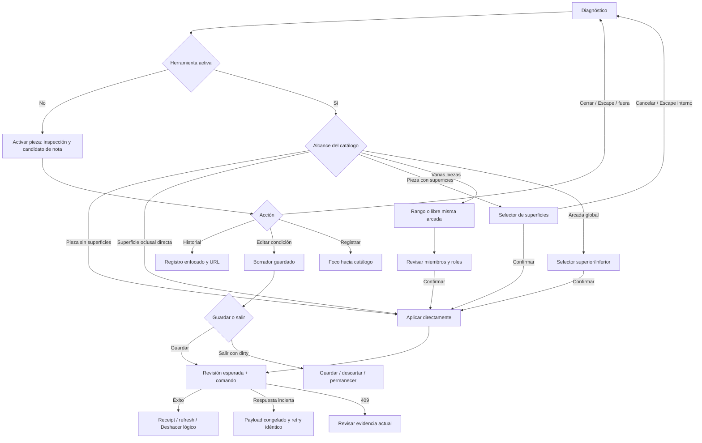

# Inventario de flujos y dependencias

Rutas y mecanismos identificados en código. "Disponible" significa montado o endpoint declarado; no todos fueron ensayados con una escritura real. Ver [cobertura](02_TECHNICAL_UX_AUDIT.md).

## Navegación

| Entrada | Bifurcaciones | Estado y salida |
|---|---|---|
| `/patients` | Search privada; filtro evoluciones; sort; asc/desc; Nuevo paciente; ficha | `PatientDirectoryProvider`; query/body privados. Reset/retorno conservan filtros seguros. |
| Formulario paciente | Crear/editar; validación RUT y campos; saving/error; cancelar | `PatientFormModal`; no borrar paciente desde UI auditada. No se envió formulario. |
| `/patients/:id` | Resumen, Información, Clínica, Actividad; Nueva evolución; Asistente contextual | `PatientDetail`; sección en query, identidad visible. |
| Resumen | Aprobaciones, drafts recuperables, fallos Drive; preparar evolución | `PatientOverview`; conteos de storage, no métricas inventadas. |
| Información | Contactos, RUT masked/copy; notas generales; create/edit/history | `PatientInformation`, `PatientNotes`. Guard dirty con save/discard/remain. |
| Clínica `clinical=diagnosis` | Diagnóstico manual, observado; dentición; estado; contexto de nota | `PatientDiagnosis`; catálogo no genera planes futuros. |
| Clínica `clinical=evolutions` | Lista, detalle, nueva evolución, errores, retorno | `PatientWorkspace`; evolución aprobada independiente de export Drive. |
| `/patients/:id/evolutions/:uuid` | Detalle en misma ficha; edit según flujo existente; historial/retorno | Path exacto; al cambiar tab se limpia UUID de detalle. |
| Actividad `tab=activity` | Todos + seis filtros; event link; paginación; retry | `PatientActivity`, `usePatientActivity`; feed derivado de revisiones. |
| `clinical=plans|planning&plan=:uuid` | Leer evidencia y revisiones; no authoring montado | `PatientClinicalPlanHistory`; filtro histórico y copy requieren simplificación F07. |
| Asistente desde ficha | Desktop panel, tablet Sheet, mobile ruta completa | Patient context, guard de trabajo y cierre; fuera de rediseño del odontograma. |

### Canonicalización

- `tab=clinical&clinical=diagnosis&condition=:uuid` debería ser forma canónica; link actual omite clinical y funciona por default.
- `treatment=:uuid` abre editor/historial; `dental_note=:uuid` abre nota con historial.
- `plan=:uuid&history=1` abre evidencia histórica. No convertir ese enlace en crear plan.
- Cambiar sección debe eliminar IDs que no pertenecen a ella; F09 identifica limpieza incompleta.
- Search clínica libre, RUT y nombre no deben entrar en URL. Los informes usan solo UUID sintéticos.

## Interacción dental actual

El arco cerrar→A no siempre elimina aspecto de selección: contexto histórico `focused` sigue alimentando `selectedTooth` (F03). Escape externo falla en selector (F02).

### Matriz de gestos

| Evento | Sin herramienta | Herramienta con superficies | Herramienta pieza completa | Multi-pieza |
|---|---|---|---|---|
| Hover/focus | Resaltar/candidato; no escribe | Preview; no escribe | Preview; no escribe | Preview; no escribe |
| Pieza por botón/teclado | Inspección | Abre selector | Escribe directamente | Añade extremo/miembro |
| Superficie oclusal pointer | Consulta pieza | Escribe esa superficie directamente | Según applicability; no pedir superficie no soportada | Selección de miembro |
| Mismo elemento otra vez | Reabre/mantiene inspección, no toggle | Checkbox sí alterna; chart disabled mientras modal | Nueva activación solo si otra herramienta sigue activa | Libre toggle; rango segundo extremo |
| Otra pieza | Cambia inspección | Primero cerrar selector | Nueva aplicación requiere herramienta | En misma arcada cambia miembros |
| Cancelar herramienta | No aplica | Cierra intent, según guard | Vuelve inspección | Borra miembros y herramienta |
| Escape | Limpia inspección/herramienta, no `focused` | Funciona dentro de modal; falla desde BODY | Cancela herramienta antes de aplicar | Section limpia tool/members; UAT dedicado pendiente |
| Clic fuera | Cierra popover | No cierra; puede perder foco | No escribe por sí mismo | Modal sin regla outside diferenciada |
| Cambiar tab/volver atrás | Navegación | Dirty guard | Bloquear mientras busy/uncertain | Dirty guard por miembros |
| Reload | Restituye query; intent local no persistido | Borrador local no garantiza recuperación | Evidencia GET persiste si realmente guardada | Selección transitoria no se guarda |

**Cinco operaciones distintas:** deseleccionar limpia contexto UI; cancelar abandona intent; descartar elimina borrador local tras guard; corregir cambia estado clínico con motivo y revisión; Deshacer emite corrección lógica del registro recién confirmado. Nunca mapear esas cinco operaciones a DELETE común.

## Entidades, fuentes de verdad y endpoints

Prefijo API global `/api`. `p` representa UUID del paciente; `r` UUID de registro.

| Entidad | Fuente de verdad | Endpoints y origen |
|---|---|---|
| Paciente | `patients` | GET `/patients`, POST `/patients/search`, POST `/patients`, GET/PATCH `/patients/p`; `routes/patients.py:97-195`. Directorio/formulario. |
| Condición | `patient_tooth_conditions`, `patient_tooth_condition_revisions` | GET `/patients/condition-catalog`; GET/POST `/patients/p/conditions`; GET/PATCH `/patients/p/conditions/r`; POST `.../corrections`; GET `.../revisions`. `patient_conditions.py:139-230`. Chart/lista/inspección. |
| Procedimiento observado/realizado | `patient_dental_treatments`, `patient_dental_treatment_teeth`, revisiones y commands | GET `/patients/treatment-catalog`; GET/POST `/patients/p/dental-treatments`; GET/PATCH detalle; POST corrections; GET revisions. `patient_treatments.py:78-141`. Herramienta, editor y corrección. |
| Nota general | `patient_notes`, `patient_note_revisions` | GET/POST `/patients/p/notes`; GET/PATCH `/notes/r`; GET revisions. `patient_notes.py:117-165`. Información; proyección derivada en feed dental. No delete expuesto. |
| Nota dental | `patient_dental_clinical_notes`, revisiones, commands | GET/POST `/patients/p/clinical-notes`; GET/PATCH detalle; POST `.../delete`; GET revisions. `patient_clinical_notes.py:26-84`. Composer compartido rail/Sheet. |
| Template de nota | Constante `TEMPLATES` | GET `/patients/clinical-note-templates`; endpoint conservado, composer diario de texto libre sin templates. Investigar consumo antes de retirar API. |
| Plan histórico | `patient_clinical_plans`, items, stages, revisions, commands | GET lista/detalle/revisions; POST crear retorna 410. PATCH plan/item/stage; POST item/stage/reorder; complete/cancel stage; confirm/accept/reopen/close/reactivate/archive permanecen backend. `patient_treatment_plans.py:34-226`. UI actual solo lectura. |
| Evolución | `evolutions`; provenance/revisión/aprobación por workflow existente | Lista/detalle/guardado y generación en `routes/evolutions.py`; aprobación y export por `evolution_exports/service.py`. Nunca usar chart para autoaprobar. |
| Actividad | Query UNION sobre saves y revisiones | GET `/patients/p/activity`; `patient_activity_repo.py:23-52`. No tabla frontend paralela ni eventos fabricados. |

## Propagación por mutación

| Acción | Escritura y refresh actual | Representaciones | Fallo y trazabilidad |
|---|---|---|---|
| Aplicar condición | create UUID; `useDentalWorkspace.perform`; callback `PatientDiagnosis.tsx:357-365` incorpora respuesta y recarga condiciones | Chart, registro por pieza, inspección, Activity al montar | Uncertain conserva command; duplicate/conflict requiere revisar. Revisión 1 durable. |
| Editar/resolver condición | PATCH con expected_revision; `PatientDiagnosis.tsx:769-787` reemplaza registro, limpia draft, reload y publica foco | Estado/superficies/lista; historial y deep link | 409 conserva local, compara campos; resolver no equivale a error. |
| Corregir/undo condición | POST correction con operation_id, reason y replacement opcional | Original en error, reemplazo, chart, historial, Activity | Receipt vincula revisiones exactas; GET fallido no repite escritura. |
| Aplicar/editar/corregir tratamiento | `useDentalWorkspace.ts:181-237,337-373`; respuesta reemplaza item y refresh treatments, callback condiciones | Miembros del chart, lista, modal, notas enlazadas y Activity | Command receipt durable; replacement original conservado. F01 afecta representación, no comando. |
| Crear/editar nota general | PatientNotes mantiene draft/attempt y recarga notas | Información; proyección en feed clínico tras nueva lectura; Activity | Revision+expected_revision, no eliminación indiscriminada por limpieza UI. |
| Crear/editar/eliminar nota dental | Hook `useDentalClinicalNotes`; feed reload después de command | Rail/Sheet compartidos, detalle por UUID, enlaces a piezas, Activity | Delete logical conserva revision/history; feed excluye deleted_at. |
| Comando de plan existente | Service→repo transacción; ejecución también altera treatment y opcional note | Evidencia de plan, observed performed, Activity, nota | UI no monta comandos; no invalidación live de plan desde UI diaria. No congelar backend sin decisión. |
| Aprobar/guardar evolución | Boundary existente; refresh lista/resumen, export separado | Evoluciones, Resumen, Activity, Drive | Ficha aprobada no desaparece si export falla. No tocar esta transacción desde odontograma. |

No React Query/SWR: "invalidación" significa actualizar state local y hacer GET de fuentes afectadas. `usePatientActivity.ts:39-45` recarga al cambiar patient/filter y al montarse. No se demostró que otra pestaña abierta se actualice inmediatamente; definir si esa capacidad es necesaria antes de añadir broadcasts o polling.

### Consistencia backend

- Ownership owner+patient precede lectura/mutación y entra en FKs compuestas. No tratar UUID presente como autorización.
- Condiciones/revisiones y correcciones comparten transacción. Tratamientos/miembros/receipt son una unidad; nota borrada y revisión también.
- Query Activity usa repeatable_read; tratamientos/notas/planes también para sus lecturas paginadas. Cada página nueva puede observar snapshot diferente; secuencias frontend descartan respuestas obsoletas.
- Condiciones y notas generales no abren repeatable_read explícito para lista; no se confirmó inconsistencia de total ni se propone migración por ese hecho aislado.
- Datos actuales y snapshots históricos no son fuentes rivales: snapshot explica evento; registro actual explica estado vigente. Etiquetar cuál se muestra.

## Inventario legacy y decisiones

| Elemento | Clasificación | Evidencia / decisión |
|---|---|---|
| Diagnósticos, opciones y procedimientos observados | **Conservar** | PRODUCT vigente; categorías habilitadas, chart y revisiones. |
| Notas generales en Información | **Conservar** | Recurso distinto, no duplicar storage con notas dentales. |
| Nota dental por diagnóstico/procedimiento | **Conservar** | Composer único, contexto typed, soft-delete y trazabilidad. |
| Feed dental incluye notas generales | **Simplificar** | `patient_clinical_notes_repo.py:190-232` hace UNION/adaptación; representación derivada, no duplicado persistido. Identificar tipo/origen. |
| Filters Notas/Notas clínicas | **Fusionar presentación** | Mantener kinds originales; una selección "Notas" puede permitir subtipo. Definir semántica sin cambiar eventos. |
| Eventos/enlaces de planes | **Reubicar presentación** | Grupo "Histórico de planes"; conservar UUIDs, revisiones y receipts. |
| Clinical `planning` como alias | **Deprecar alias de navegación** | Resolver a evidencia histórica; no redirect a autoría ni borrar registros. |
| Plan editor/create | **Eliminar de UI, ya retirado** | No montaje en PatientDetail; backend create 410. No hay evidencia de otro editor diario activo. |
| Badge/filter "Planes" equivalente a diagnóstico vigente | **Eliminar de navegación diaria** | Reemplazar acceso por histórico; conservar eventos en Todos y acceso filtrado histórico. |
| Templates/endpoint anterior | **Investigar antes de decidir** | Endpoint persiste; la nota diaria usa texto libre. Revisar consumidores externos/tests antes de deprecar. |
| APIs de planes existentes | **Investigar antes de decidir** | H01; commands siguen owner-scoped. Retirar UI no retira contrato backend automáticamente. |
| Legend y palette | **Fusionar contrato visual** | Generar semántica desde registro de catálogo; mantener leyenda compacta por conceptos. |
| Varios dialogs dentales | **Simplificar responsabilidad compartida** | Surface/scope/record reutilizan DentalConditionModal; popover de inspección cumple función diferente. No duplicación por nombre solamente. |

Causa temporal del legacy: OpenSpec mirror amplió planificación (`proposal.md:13-16,D01-D04`), mientras el brief del 7 de octubre retiró editor/creación, no historia (`patient-workspace.md:113-125`). No hay base para atribuirlo a descuido sin revisar esa decisión explícita.

## Bifurcaciones que aún requieren UAT

- Corrección persistida con replacement, notas vinculadas, Activity y reload en DB aislada.
- Multi-pieza con roles y cancelación después de primer extremo; error de arcada mixta; mismos miembros.
- Guardado incierto, GET posterior fallido y segundo 409 bajo concurrencia real.
- Nota dental eliminada y consulta histórica exacta; detalle de plan/nota con teclado.
- Paciente con cientos de condiciones/notas y varios planes existentes; no simular uso real por conteo de fixtures.
- Edición de evolución cancelada y regreso a ficha; aprobación/export permanecen gates del flujo existente.
