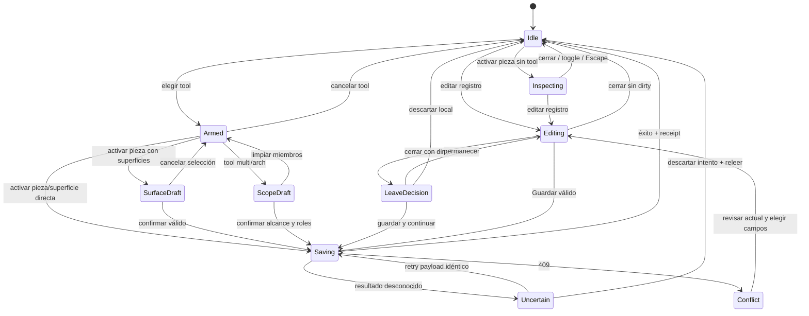

# Propuesta Shape

**Brief para confirmación. No es contrato de diseño aprobado ni implementación.**

## Trabajo, audiencia y prueba

Odontólogo durante consulta, modo Operate. Debe consultar evidencia y registrar una observación en pieza/superficie con contexto suficiente, corregir una entrada equivocada y seguir atendiendo. La prueba de éxito es completar esos recorridos con estado y destino predecibles, no hacer más atractivo el SVG.

Mantener Quiet Clinical Workbench, tokens semánticos, anatomía FDI y vocabulario español. La evidencia de esta dirección es [F01-F12](02_TECHNICAL_UX_AUDIT.md); ninguna propuesta depende de añadir planificación o automatización IA.

## Arquitectura de información objetivo

```text
Pacientes
  Directorio y búsqueda privada
  Ficha
    Resumen
    Información
      Identidad/contacto
      Notas generales
    Clínica
      Diagnóstico
        Odontograma + contexto operativo
        Catálogo contextual
        Registros por pieza / estado
        Notas clínicas (rail o Sheet compartido)
      Evoluciones
    Actividad
      Eventos guardados
      Filtros diarios
      Histórico de planes (lectura)
```

No convertir Activity en otra fuente de verdad. Histórico de planes puede continuar usando URL legacy compatible y el componente read-only existente; no necesita una nueva página.

## Dirección de interacción

- **Inspeccionar** muestra evidencia guardada, sin escritura. Pieza elegida y botón Cerrar pieza son visibles. Repetir activación de pieza inspeccionada puede cerrar si no existe borrador; no aplicar ese toggle a registro clínico.
- **Herramienta activa** se identifica junto al chart con nombre y consecuencia breve: "Caries · activar superficie registra". El catálogo determina alcance.
- **Selección de superficies/múltiples piezas** es draft transitorio. Cancelar abandona draft; limpiar miembros conserva herramienta. Se confirman solo alcances que ya requieren confirmación.
- **Referencia histórica** usa borde secundario o marcador textual "Registro consultado". No `aria-pressed` de selección operativa. Cerrar inspector no elimina historia ni convierte condición en resuelta.
- **Editar registro guardado** exige Guardar. Con dirty, cerrar/navegar pasa por guardar/descartar/permanecer; sin dirty, salida inmediata.
- **Corregir registro** es operación clínica con motivo, expected_revision y receipt. **Deshacer** sigue anotando entered_in_error para entrada reciente. Nunca DELETE genérico.

D03 autorizó aplicación directa desde herramienta/pieza y superficie oclusal. Esta propuesta no introduce Guardar universal ni cambia silenciosamente ese contrato. Si producto quisiera revisar toda escritura antes de enviar, requiere otra decisión explícita y otro scope.

## Flujos afectados

| Flujo actual | Problema | Flujo propuesto | Se elimina / se conserva | Riesgo y prueba |
|---|---|---|---|---|
| Tool → pieza → superficie → Confirmar | Escape depende de foco; cerrar cancela tool y draft juntos | Mismo flujo, cierre modal gestionado, Cancelar vuelve a contexto claro | Conserva confirmación; elimina necesidad de reenfocar para Escape | No perder draft guardado; T02. |
| Activity → condición → inspeccionar → Cerrar → tooth pressed | Referencia histórica aparenta intent | Consultar registro mantiene marcador histórico; inspector cerrado vuelve a idle operativo | Elimina toggle distante de historial para entender salida | No borrar URL/evidencia histórica sin acción explícita; T03. |
| Puente → rango accidental → cancelar tool/reseleccionar | Reinicio parcial costoso | Puente → limpiar miembros → rango correcto → revisar roles | Conserva tool, modo, misma arcada y confirmación | No limpiar payload uncertain; T04. |
| Restauradora → explorar 29 tarjetas | Scan lento y altura excesiva | Categoría → filtro texto opcional → acción compacta → pieza | Conserva 29 variantes; reduce decoración/altura y búsqueda manual | No ocultar variant id ni soporte; T05/T06. |
| Activity → Planes como filtro igual a procedimientos | Flujo retirado parece vigente | Activity → histórico de planes → evidencia con encabezado read-only | Conserva eventos e IDs; retira presentación diaria equivalente | Compatibilidad links y sin pérdidas; T07/T09. |
| Nota seleccionada → revisión con UUID aunque haya nombre | Metadata descartada | Detalle enfocado → actor declarado o UUID fallback | Conserva trazabilidad; quita inconsistencia de presentación | No inventar identidad; T10/T12. |

No se publica ahorro de clics estimado. Se verificaron puntos de activación/cancelación, pero no se ejecutó una implementación del flujo propuesto. Conteos comparativos se medirán en S7.

## Especificación visual y responsive

### Catálogo

Seleccionar **categoría compacta + búsqueda contextual + lista compacta de operaciones**. Reutilizar Button, input/label y controles nativos. Categoría tiene tratamiento de navegación neutro; herramienta seleccionada lleva símbolo, nombre, texto de alcance y estado activo distinguible.

Desktop permite filas en grid si la anchura lo facilita; cada opción conserva target mínimo. En narrow, filas legibles con icono pequeño y nombre completo, sin forzar todas a tarjeta ilustrada de 72 px. La ilustración amplia queda para tool/preview o ayuda contextual.

Ocho categorías no caben bien en segmented control móvil: se rechaza esa alternativa. Un selector etiquetado evita filas de botones de mismo peso. Búsqueda opera dentro de categoría, con conteo de resultados y limpiar; solo mostrarla cuando la lista tenga volumen suficiente. Restauradora es caso comprobado. Sin acordeón/subcategorías/favoritos adicionales en primera versión.

Mantener orden clínico del catálogo mientras producto lo valida; no ordenar FDI alfabética o numéricamente en gráfico. Familias y variantes deben tener orden estable por catálogo, no una nueva copia de datos UI.

### Inspección

Mantener popover no modal en desktop. Encabezado "Pieza 16" + Cerrar pieza; cuerpo con evidencia por tipo y estado; acción Registrar subordinada que dirige al catálogo. No exigir focus trap en popover no modal. Escape cierra mientras foco pertenece a la interacción; salida por Tab debe estar definida y anunciada.

En narrow, usar panel/Sheet existente solo si tamaño del detalle desborda área útil. Evitar convertir automáticamente cada pieza en modal de pantalla completa. Debe comprobarse posición, ancla visible y retorno de foco.

### Selector de superficies y editor

Mantener selector compacto: identidad/tool primero; vista oclusal principal; vista lateral secundaria; checkbox de superficies debajo; Cancelar secundario y Confirmar primario al final. Reducir dos contenedores decorativos grandes si no ayudan a tarea. No crear formulario en SVG.

Editor guardado separa evidencia inmutable y campos editables. "Realizado", "Existente" y "Registrado por error" son etiquetas diferentes, aun cuando dos de esos estados sean read-only. Corregir está en disclosure secundario con explicación de motivo/historial; no botón Eliminar ambiguo.

Reutilizar `DentalConditionModal` para surface/scope/record y corregir su comportamiento común. Radix `alert-dialog` ya soporta guards/confirmaciones; `sheet` ya soporta notas. No nueva librería ni primitive fuera de allowlist.

### Estados, feedback y contraste

Selection y keyboard focus tienen tratamientos distintos. Color clínico va con símbolo/texto; azul de selección no cambia semántica de evidencia. Busy bloquea duplicados, mantiene ancho de botón y anuncia guardado. Éxito identifica registro; error mantiene draft y propone retry/review/cancel.

Inert/backdrop y Escape deben funcionar juntos. Fuera del popover sin cambios puede cerrar; fuera de editor con cambios no puede descartarlos. Selector sin texto persistido puede cancelar mediante Escape; decisión de outside no debe ser accidental consecuencia de foco BODY.

Mobile conserva controles de 44 px del contrato. Chart puede mantener scroll anatómico con cuadrantes. O01 propone reducir vista inicial por cuadrante solo tras prueba de comprensión. O02 requiere que Notas no tape target/focus; primero ajustar su ubicación o reserva de espacio, sin más chrome.

## Máquina de estados conceptual

Dos dimensiones evitan inflar combinaciones: **contexto consultado** (`none|recordRef`) e **interacción operativa**. `recordRef` no escribe ni equivale a selection. Guardado y error son fases del command, no selección dental.



Error de validación 422 vuelve al draft correspondiente con mensaje; 404 conserva draft y permite leer/abandonar. No reutilizar payload rechazado como si fuese uncertain. Success se representa con receipt/feedback; no hace falta estado permanente Success adicional.

| Transición | Precondición y resultado | Cancelación |
|---|---|---|
| Elegir tool | Supported, dentition compatible; tool armada sin write | Toggle mismo tool o Cancelar herramienta. |
| Inspeccionar pieza | Sin draft/busy; una inspección anclada | Cerrar, Escape, fuera; sin borrar recordRef. |
| Elegir superficie | Tool admite superficie; cambia draft | Checkbox toggle; cancelar draft no borra saved condition. |
| Seleccionar rango | Misma arcada/dentición; miembros válidos | Limpiar miembros; Escape primero limpia selección. |
| Guardar | Draft válido, no busy/uncertain; command único | Durante saving no "deshacer" solicitud incierta. |
| Salir con dirty | Guard local sabe si save disponible | Guardar, descartar local, permanecer; no cerrar silenciosamente. |
| Retry uncertain | Command congelado completo | Descartar solo abandona intento; releer para averiguar resultado. |
| Resolver conflicto | Leer latest; decisiones por campo y reconfirmar | Permanecer o descartar draft; nunca force-write. |
| Deshacer confirmado | Receipt reciente, revisión válida | Nueva corrección lógica; si conflicto, revisar evidencia. |
| Navegar/cambiar dentición | Contexto compatible y no busy; dirty guard antes | Permanecer conserva draft; success/discard ejecutan continuación. |

Implementación puede ampliar `useDentalWorkspace` para intent transitorio y mantener edición/historial en sus módulos actuales. No mover 2487 líneas por longitud ni introducir store global. Primero tests de transiciones y seams reales; extraer solo responsabilidad que elimina F02/F03/F04.

## Decisiones pendientes de producto

1. **Planes existentes:** ¿retiro solo de creación/authoring UI, como implementación actual, o freeze de todas sus mutaciones API? Recomendación inicial: conservar lectura y compatibilidad; inventariar clientes antes de congelar commands. La propuesta no autoriza ese freeze.
2. **Autor de evolución:** ¿debe atribuirse aprobación/guardado como actor durable distinto de owner? Si sí, usar provenance confiable disponible o nueva columna para nuevos registros; no backfill especulativo.
3. **Confirmar brief objetivo:** aprobar categoría compacta/filtro/lista y separación de referencia histórica. O01 de cuadrante inicial puede permanecer fuera del primer release.

Scope y audiencia ya fueron definidos por encargo. No se solicitan colores, stacks, eliminación de diagnósticos ni nuevas capacidades. Tras confirmar, [plan por slices](06_IMPLEMENTATION_PLAN.md) está listo para ejecución controlada.
