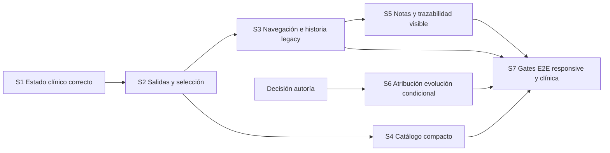

# Plan de implementación

No implementación iniciada. Los archivos son probables, no lista de cambios autorizados. Toda escritura clínica de verificación debe usar DB aislada y paciente sintético; producción queda read-only durante validación de auditoría.

## Orden y dependencias



S1 y S2 son prioridad P1 y deben salir antes de cambios cosméticos. S3-S5 P2. S6 es condicional; no bloquea correcciones UI mientras producto decide. S7 no es una bolsa de defectos para el final: cada slice valida su aceptación, S7 valida combinación y release.

## S1 · Estado clínico correcto de extremo a extremo

- **Objetivo / findings:** F01. `performed` nunca se presenta como entered_in_error; permitted actions y label se deciden por separado.
- **Alcance:** chart, list, popover, global-arch strip, editor y texto accesible; cinco estados exhaustivos. `planned/cancelled` no se añaden al diagnóstico diario por esta corrección.
- **Archivos:** `PatientDiagnosis.tsx`, `PatientOdontogram.tsx`, `TreatmentRecordModal.tsx`, helper de presentación de tratamientos existente o función acotada en `lib/`; tests correspondientes.
- **Frontend:** mapping exhaustivo; read-only explica motivo sin falsificar estado. Un único mapping de label/symbol reduce duplicación comprobada.
- **Backend / persistencia:** no cambios previstos. Inspeccionar fixtures/schema/plan execution para garantizar contrato de enum. No update de registros para que coincidan con UI.
- **Dependencias:** ninguna; usa fixtures performed y un performed real en DB aislada.
- **Riesgo / mitigación:** habilitar edición clínica prohibida por accidente; conservar política actual hasta decisión explícita, verificar capability por estado.
- **Tests:** T01 unit/render todas etiquetas; HTTP/DB isolated generación performed; E2E create vía plan existente solo si permitido, luego detalle/lista/chart/reload.
- **Aceptación:** mismo UUID `performed` lee "Realizado" en todas vistas; entered_in_error sí lee error; no escritura por abrir detalle.
- **Complejidad:** S.
- **Rollback:** revertir presentación sin tocar datos; conservar pruebas que documentan contrato.
- **Fuera de alcance:** reactivar planes, nuevos estados, nuevo flujo de ejecución.

## S2 · Selección, cancelación y cierre predecibles

- **Objetivo / findings:** F02-F04. Toda interacción tiene salida sin borrar evidencia ni abandonar un command incierto.
- **Alcance:** diferenciar focused record/inspection/operative selection; cierre modal; limpiar miembros/range anchor; Escape jerárquico; guards de dirty/busy/uncertain.
- **Archivos:** `PatientDiagnosis.tsx`, `useDentalWorkspace.ts`, `PatientOdontogram.tsx`, `DentalConditionModal.tsx`, `ToothInspectionPopover.tsx`, consumidores scope/record y tests.
- **Frontend:** intent transitorio con dueño claro; focused record no alimenta pressed operativo. Modal maneja foco/backdrop/Escape globalmente durante su vida y retorna trigger conectado. Limpiar selección solo aparece si hay miembros.
- **Backend / persistencia:** no cambio de endpoints o payloads. Guardar y correcciones mantienen UUID/expected_revision/reason.
- **Dependencias:** S1 para no diseñar salidas sobre labels erróneos.
- **Riesgos:** quitar historial consultado, soltar draft antes del guard, aplicar tooth al intentar cerrar, repetir write tras timeout. Tests verifican requests=0 en gestos de salida.
- **Tests:** T02 outside→Escape, Tab/Shift+Tab/focus retorno; T03 Activity→inspect→close y ordinary close; T04 rango primer extremo→clear→otro rango, libre toggle, misma arcada, cancel. Superficie toggle/cancel; Back y tab con dirty; busy/uncertain congelados.
- **Aceptación:** después de cerrar inspección no queda selección operativa; marcador histórico puede seguir explícito. Escape funciona aun después de clic externo. Clear no cambia tool y no escribe. Guard protege texto guardado/editado.
- **Complejidad:** M.
- **Rollback:** revertir UI/state slice; no migración ni borrado. Nunca rollback mediante correcciones masivas a datos.
- **Fuera de alcance:** nueva state library, shortcuts globales amplios, cambio de D03, rediseño de anatomy.

## S3 · Historia legacy legible y URLs canónicas

- **Objetivo / findings:** F07, F09 y parte de F12. Actividad informa eventos; planificación histórica se reconoce como tal.
- **Alcance:** filtros/copys; entrada histórica read-only; clean query IDs; enlaces de condiciones con clinical explícito; foco de destino de plan.
- **Archivos:** `PatientActivity.tsx`, `PatientDetail.tsx`, `PatientClinicalPlanHistory.tsx`, `routes/patient_activity.py`, tests Activity/detail/plan.
- **Frontend:** diario sin Planes equivalente a modos clínicos; histórico accesible en Todos y filtro/acceso histórico secundario. Alias planning sigue resolviendo evidencia. No borrar notas clínicas/generales.
- **Backend:** solo generación de href canónico. Commands de planes intactos hasta decisión H01. Actualizar docs de contratos después de aprobación, no suprimir schemas por falta de botón.
- **Persistencia:** sin migración; mismos eventos/revisions/IDs.
- **Dependencias:** S2 guards; acuerdo sobre etiqueta/ubicación de histórico, no freeze API.
- **Riesgos:** links antiguos rotos o eventos escondidos. Fixtures con varios planes, tratamientos enlazados, notas y UUID fuera de página 1.
- **Tests:** T07 histórico accesible/read-only/sin create; T09 query round trips diagnóstico/evoluciones/planes/back/reload; T12 foco destino plan. HTTP owned links y not-found.
- **Aceptación:** cualquier link viejo de plan abre historia; no authoring visible; cambiar a diagnóstico elimina plan ajeno al modo; filtro Todos conserva todos los eventos.
- **Complejidad:** M.
- **Rollback:** reponer navegación/filter anteriores, manteniendo enlaces canónicos compatibles y storage intacto.
- **Fuera de alcance:** eliminar tablas/servicios, borrar planes, freeze API sin decisión de producto.

## S4 · Catálogo y leyenda compactos

- **Objetivo / findings:** F05/F06/F08; O02 solo si prueba muestra obstrucción.
- **Alcance:** category compacta, filtro contextual, acciones compactas, label variante, legend por conceptos; no cambio de significado clínico.
- **Archivos:** `PatientDiagnosis.tsx`, `DentalLegend.tsx`, `odontogramPresentation.ts`, tokens existentes si hace falta reutilizarlos; tests de presentación y snapshots existentes.
- **Frontend:** controles nativos y Button existentes; stable variant id; contador de filtro; empty/search clear; state activo distinto de categoría. No almacenar catálogo duplicado para UI.
- **Backend:** ninguno previsto. Si hay orden catálogo acordado, mantenerlo en registro existente con tests; no añadir endpoint de búsqueda para 63 entradas.
- **Persistencia:** sin cambios. No renombrar ids ni códigos clínicos.
- **Dependencias:** S2 para tool/selection; aprobación del brief visual. Se puede trabajar después de S3 o independientemente si archivos no colisionan.
- **Riesgos:** opción clínica desaparece de search, tool seleccionado oculto, cambio de soporte surface. Gates inventario 12 findings + 63 variantes, disabled/dentition preservados.
- **Tests:** T05 todas variantes encontrables, diacríticos/sin resultados, orden determinista; T06 category no escribe y tool no escribe hasta activación; T08 crown variants/legend; responsive 390/768/1440 y coarse44.
- **Aceptación:** localizar corona zirconio sin recorrer 29 tarjetas; distinción categoría/acción; labels completos; explicación visual de crown sin fingir que metal-cerámica es única variante. Medir scroll/click antes/después con mismos datos.
- **Complejidad:** M.
- **Rollback:** reponer layout anterior con mismos ids/state; guardar helper semántico si es independiente.
- **Fuera de alcance:** nuevas terapias, favoritos, IA sugeridora, subcategorías especulativas, eight-way segmented móvil.

## S5 · Notas coherentes y autor visible donde ya existe

- **Objetivo / findings:** F10/F12; clarificar proyección de nota general en feed.
- **Alcance:** transportar actor_display_name disponible; foco en deep link nota; preservar composer shared, edit/body-only/delete/history y contexts.
- **Archivos:** `lib/api.ts`, `PatientDentalNoteDetail.tsx`, `PatientActorLabel.tsx` si composición actual lo necesita, `DentalClinicalNotes.tsx`, `useDentalClinicalNotes.ts` solo si aparece invalidación defectuosa en tests.
- **Frontend:** metadata typed completa; foco una vez por target, no al paginar; origen general/clínico visible sin duplicar nota.
- **Backend:** no cambio previsto para F10; ya entrega nombre. Comprobar serialización de revisions en HTTP.
- **Persistencia:** mismas notas e historial; no fusionar tablas. Delete clinical sigue logical; general no gana delete nuevo.
- **Dependencias:** S3 navegación; S2 guards.
- **Riesgos:** retarget de nota al cambiar candidato; focus robado en async; perder feed general por limpieza. Verificar edit no cambia association.
- **Tests:** T10 actor con nombre/null y múltiples UUID; T12 Activity note→foco/history→reload; delete lógico→feed excluye→exact detail conserva historial; rail/Sheet conservan draft.
- **Aceptación:** mismo autor leído con mismo nombre o fallback en Activity/history; nota general conserva id/origen; cancel no guarda; delete no borra revisiones ni tratamiento relacionado.
- **Complejidad:** S/M.
- **Rollback:** revertir render/typing; ningún data backfill.
- **Fuera de alcance:** attachments, templates nuevos, notas IA, editar asociación de nota guardada.

## S6 · Autoría de evolución, condicionado a producto

- **Objetivo / finding:** F11. Recuperar atribución confiable o registrar actor para nuevas aprobaciones/guardados.
- **Alcance:** primero seguir provenance/approved artifact para decidir si existe actor durable recuperable. Si existe, proyectarlo; si no existe y producto lo exige, columna nullable aditiva con semántica explícita.
- **Archivos probables:** `routes/evolutions.py`, `evolution_exports/service.py`, `db/evolutions_repo.py`, `db/patient_activity_repo.py`, schemas/client typed; nueva Alembic solo si necesaria.
- **Frontend:** presentar actor declarado con UUID fallback; legacy desconocido continúa desconocido.
- **Backend/persistencia:** save boundary captura actor confiable dentro de transacción; export retry no altera autor. No asumir que owner equivale a autor/aprobador ni rellenar todo histórico con propietario.
- **Dependencias:** decisión de autoría; revisión humana de boundary de aprobación; separación de export y save existente.
- **Riesgos:** atribución falsa y migración que modifica historia. Mitigación nullable, cero backfill especulativo, prueba proveniencia/historical/new.
- **Tests:** T11 SQL/HTTP/isolated DB approval→save→Activity→reload, failed Drive y retry no cambian actor, foreign owner no lee. Down/compatibilidad de versión vieja si hay migración.
- **Aceptación:** evolución nueva tiene actor trazable según definición aprobada; anterior sin fuente confiable sigue desconocida.
- **Complejidad:** M si proyección, L si nuevo contrato/migración.
- **Rollback:** si columna aditiva, volver a versión vieja manteniendo columna/datos; no drop en rollback operativo.
- **Fuera de alcance:** certificación de credenciales, firma digital, multi-user clinic/RBAC.

## S7 · Gates transversales y release

- **Objetivo:** comprobar solución integrada, sin afirmar completitud por pasar solo unit tests.
- **Alcance/archivos:** suites patient UI/HTTP/DB existentes, Playwright y snapshots scoped; docs de aceptación; no nuevos features.
- **Frontend:** 390/768/1440, teclado/mouse/touch emulado, 200% zoom, reduced-motion, foco no tapado, labels y contrastes reales. NVDA si disponible.
- **Backend:** DB PostgreSQL aislada; corrección/replace/undo, logical delete, ownership, idempotency, 409 concurrente y rollback transaccional.
- **Persistencia:** solo datos sintéticos; snapshots antes/después para demostrar conservación de revisiones y relación original/reemplazo.
- **Dependencias:** S1-S5; S6 solo si elegido. H01 resuelto antes de alterar API de planes.
- **Riesgos:** fixture/UI diverge backend, snapshots aprueban bug, false zero counts. Separar evidencia real de mock y mantener page totals/retry.
- **Tests:** T01-T12; latencia y respuesta perdida; navegar/recargar después de cada commit; varios registros y >1 cursor page; clínica vacía y errores catalog/GET.
- **Aceptación:** no P1 abierto; consistent record UUID/state en todas representaciones; cero write por hover/focus/close; datos históricos disponibles; matriz completa con enlaces a evidencias.
- **Complejidad:** M.
- **Rollback:** detener release al fallar gate; volver a slice previo validado, sin "reparar" historia con DELETE.
- **Fuera de alcance:** benchmarking global app/RAG/Drive, rediseño de login, QA de toda DentalPin.

## Validación por slice y antes de PR

Para cada slice: regression fail-first del finding; checks focalizados; browser proof del comportamiento completo. Al integrar y antes de PR/commit, suite completa del AGENTS.md:

```text
backend: uv run ruff check .
backend: uv run ruff format --check .
backend: uv run mypy .
backend: uv run pytest tests -xvs
frontend: bun run tsc --noEmit
frontend: bun x biome check src
frontend: bun run test
```

Build/runtime por Docker. No sobreescribir snapshots sin explicar cambio y revisar screenshot/ARIA. No commit/push ni migración forman parte de esta auditoría.
