# Auditoría comparativa del diagnóstico: Dental AI Assistant y DentalPin

Fecha: 6 de octubre de 2026. Alcance: investigar y proponer; sin cambios de producto, migraciones ni escrituras clínicas. Se usó la pestaña existente del navegador nativo de Codex mediante `cua_repl` y locators Playwright, siguiendo la skill `playwright-cli` solicitada y la guía de auditoría de producto. No se ejecutó una sesión CLI externa ni se grabó video.

## Dictamen

Dental AI Assistant tiene una base funcional de diagnóstico manual y trazabilidad, pero su interacción todavía se comporta como un formulario conectado a un gráfico. DentalPin organiza el trabajo alrededor del odontograma. La distancia más visible está en la continuidad del flujo, la anatomía y los símbolos, la proximidad del editor y la composición de notas/condiciones.

Los doce conceptos diagnósticos de la referencia ya tienen equivalentes en el catálogo actual. No falta empezar de cero con ese vocabulario. Sí faltan siete familias terapéuticas, el dominio de tratamientos/planes y la experiencia de notas clínicas independientes para un mirror completo.

DentalPin es un referente de interacción y presentación en esta comparación, no una norma clínica ni una certificación de calidad. Esta auditoría no evalúa cumplimiento de una norma odontológica. Tampoco establece un porcentaje artificial de paridad: compara capacidades y evidencia por dimensión.

| Dimensión | Estado de Dental AI Assistant | Distancia al referente |
|---|---|---|
| Doce conceptos diagnósticos básicos | Implementados, con catálogo backend y superficies declaradas | Corta en vocabulario; falta equivalencia visual y de interacción |
| Selección, edición y revisión | Borrador explícito, Guardar, resolver/corregir e historial | Base sólida; consulta de diente y editor tienen fricción |
| Odontograma anatómico | 32/20 FDI, vistas lateral/oclusal, cuatro perfiles de familia | Considerable en detalle anatómico, overlays y lectura contextual |
| Continuidad del flujo | Chart → selector → paleta → editor; foco desplaza la vista | Considerable, especialmente con navegación expandida |
| Notas del diagnóstico | Nota dentro de la condición; notas generales en Información | Falta el rail y las notas independientes con vínculo dental |
| Tratamientos y planes | No están modelados por esta API de condiciones | Falta funcional de dominio, no solo de diseño |
| Trazabilidad y guardado | Revisiones, conflictos, reintentos y correcciones explícitas | Ventajas que deben conservarse al adaptar el referente |

## Evidencia y condiciones de comparación

Destino observado: paciente Juan Perez, `http://localhost:8000/patients/0eabd44e-1822-4550-8910-e35c5877b3f3?tab=clinical&clinical=diagnosis`.

Referencia reabierta durante esta auditoría: Javier Sánchez Muñoz, `http://localhost:3000/patients/d6eebc99-9c0b-4ef8-bb6d-6bb9bd380a46`. No se usaron capturas anteriores como evidencia nueva. El recorrido previo sirve de contexto; la composición y el popup de Caries se verificaron otra vez.

Las capturas aceptadas están en `artifacts/diagnosis-audit-20261006/`. Se guardaron e inspeccionaron los mismos bytes del navegador. Son pantallas de distintos pacientes y distinto volumen de datos, por lo que no se comparan cantidades ni resultados clínicos. Destino y referencia se observaron aproximadamente a 1189×792; no se presentan como una comparación pixel-perfect.

El destino no mostró condiciones guardadas en Permanente, ni bajo Actuales ni Todas. Por ello no se probaron sobre registros reales la edición, resolución o corrección. No se crearon registros para llenar ese vacío. Esas rutas se revisaron en fuente y pruebas automatizadas.

Se intentó un override de viewport móvil, pero se aplicó a la pestaña de referencia, no al destino: la captura 13 fue rechazada y renombrada. Se restauró el viewport. No hay evidencia móvil válida ni pruebas de zoom o lector de pantalla en este informe.

## Recorrido actual y estado de cada paso

| Paso | Qué hace el usuario y qué ocurre | Salud / evidencia |
|---|---|---|
| 1 | Pacientes → Juan Perez → Clínica → Diagnóstico | Funcional. La URL conserva la sección. Captura 14 |
| 2 | Ve Diagnóstico manual; Permanente/Temporal están en su header, fuera del chart | Funcional, agrupación visual débil. Capturas 06 y 14 |
| 3 | Pulsa 16 en el chart sin concepto seleccionado | Crea un borrador vacío de concepto y enfoca Nota; la vista baja al editor. Captura 02 |
| 4 | Elige Caries | Actualiza el borrador, habilita Guardar y muestra cinco superficies. Captura 03 |
| 5 | Marca Mesial y Oclusal | Cambia la miniatura del editor; el chart principal recibe registros persistidos, no esta previsualización de superficies. Captura 03 y fuente |
| 6 | Pulsa Cambiar pieza | Enfoca el select `chart-tooth`; vuelve hacia arriba. La URL no cambia. Captura 04 |
| 7 | Intenta Temporal con borrador | Aparece Condición sin guardar con seguir/descartar/guardar. Se descartó el borrador de auditoría. Captura 05 |
| 8 | Cambia a Temporal y vuelve a Permanente | Cambia a 20 posiciones FDI y después 32, sin alta clínica. Captura 06 |
| 9 | Elige Pulpitis antes de seleccionar diente | Crea borrador sin pieza y enfoca Elegir pieza en el editor; sigue sin mantener una interacción centrada en el chart. Captura 09 |
| 10 | Revisa Condiciones por pieza y Estado | Lista vacía confirmada en este paciente; filtros funcionan. Fuente muestra un artículo por condición, no agrupación compacta por FDI |
| 11 | Colapsa la navegación | Con 1067.64 px disponibles aparece el inspector de 300 px; con 863.64 px se apila. Capturas 11 y 12 |
| 12 | Guardar → registro, editar/resolver/corregir → historial | Implementado en código y cubierto por pruebas; persistencia real no ejercitada en esta auditoría |
| 13 | Notas independientes y continuar a plan | No existe ese cierre de flujo en Diagnóstico actual; no hay rail ni CTA de plan equivalente |

Al finalizar quedaron Permanente, Actuales, navegación expandida y ningún borrador/modal de auditoría abierto. No se guardaron condiciones, notas ni planes.

### Evidencia visual principal

Vista actual con navegación expandida:

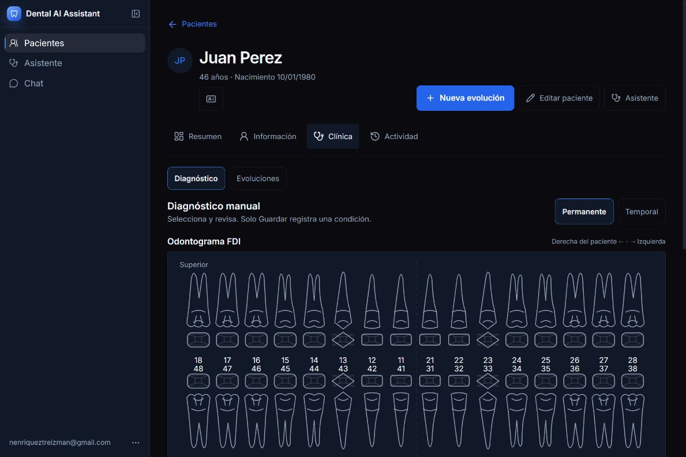

Referencia con dentición dentro de Dental Chart y rail de notas:

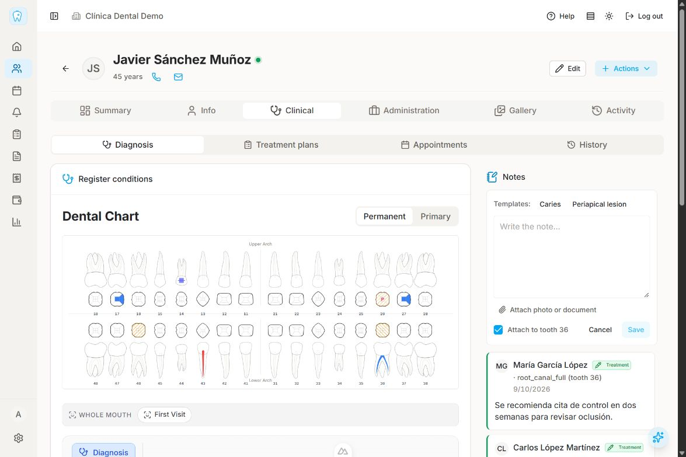

Tras pulsar el diente en el destino:

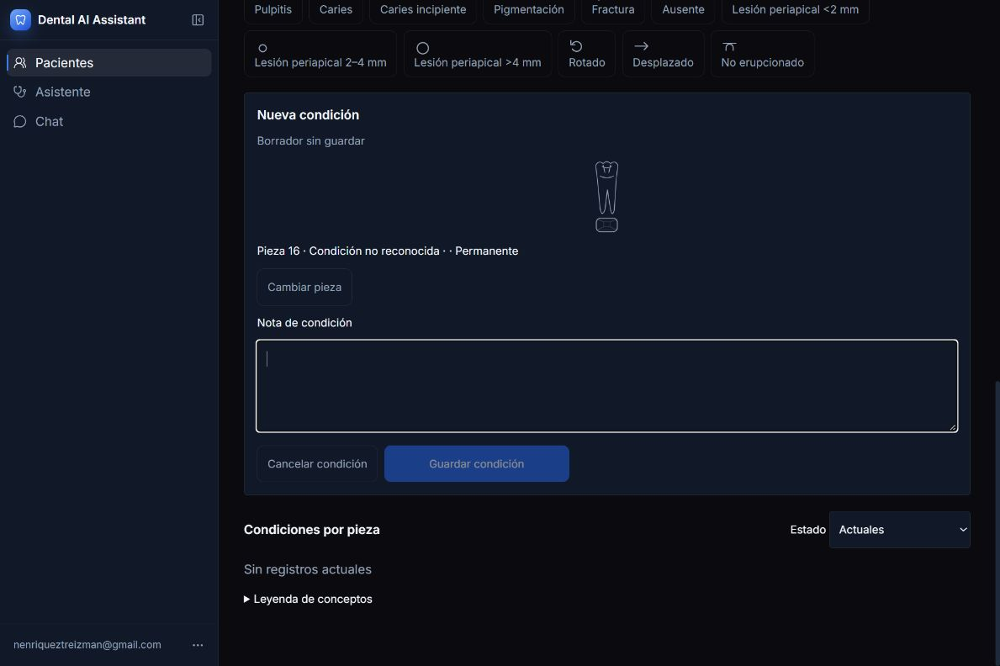

Editor de superficies en el destino:

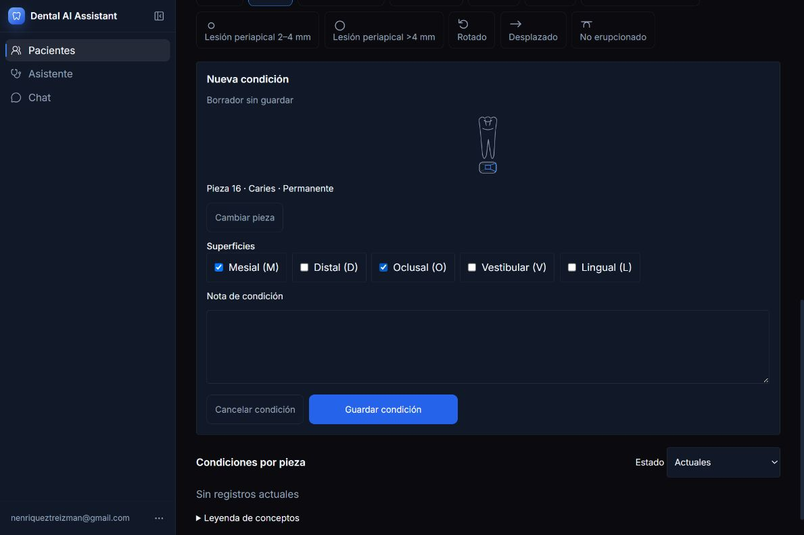

Selector contextual en la referencia:

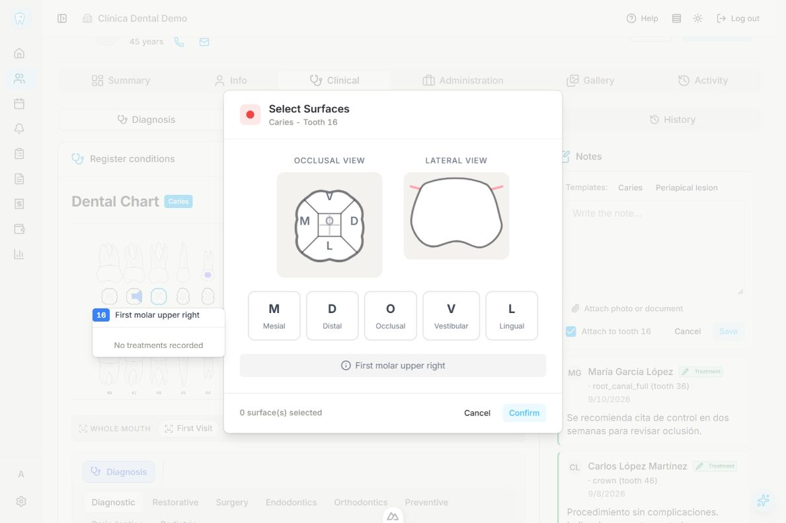

El inspector sí existe cuando cabe:

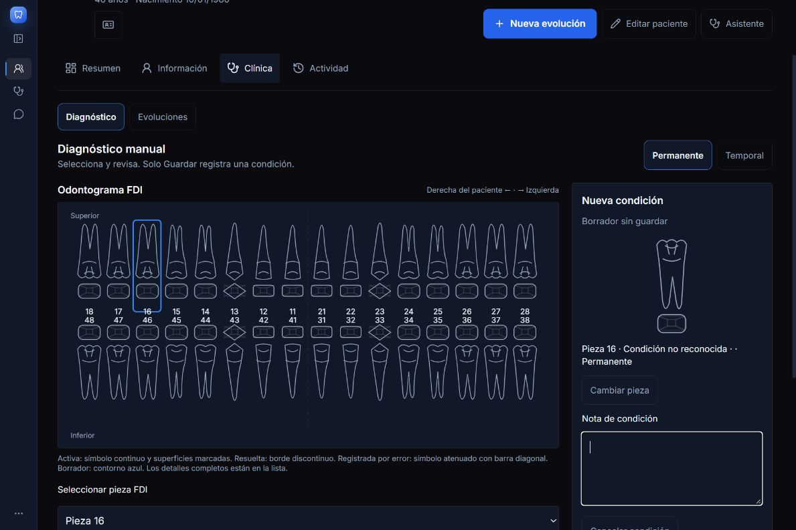

## Hallazgos críticos y causas

| ID | Prioridad | Hallazgo confirmado y causa | Adaptación propuesta |
|---|---|---|---|
| F1 | P1 de experiencia | El clic de consulta se convierte en creación de borrador y salto de foco. `chooseTooth` enfoca superficies o nota; sin herramienta enfoca nota. No hay modo de inspección dental previo | Sin herramienta: seleccionar/consultar diente y sus registros en contexto. Con herramienta: preparar editor. Diferenciar inspección, selección, hover y borrador |
| F2 | P1 de experiencia | La misma operación se reparte entre chart, select, botones y editor. A 863 px el editor queda debajo; Cambiar pieza enfoca un control anterior | Editor contextual compacto en anchos intermedios; inspector cuando realmente cabe. Integrar el selector alternativo en el contexto del diente, conservando acceso por teclado |
| F3 | P2 | Un código vacío se presenta como “Condición no reconocida ·”. `labels` incluye `''` y `resolveCondition` aplica el fallback de código desconocido | Distinguir “Elige un diagnóstico” de un código persistido desconocido. Cambiar el orden de interacción para no crear un formulario de nota antes de elegir concepto |
| F4 | P2 | Permanente/Temporal están en el header general, separados de la propiedad que cambian | Colocar dentición junto al título del odontograma, dentro de Registrar condiciones. Conservar la guardia de borrador y el estado seleccionado accesible |
| F5 | P2 | Anatomía basada en cuatro perfiles reutilizados; iconos generales, casi monocromos, sin la relación anatómica de la referencia | Mejorar geometría/activos revisados por odontología, símbolos por concepto y overlays localizados. Conservar orientación FDI y la representación textual |
| F6 | P2 | En el chart principal se colorea la unión de superficies de condiciones activas en azul. El tipo se representa con pequeños símbolos adicionales; el borrador de superficies solo se ve en la miniatura | Renderizar por concepto/estado, explicar coexistencia y añadir previsualización de borrador diferenciada de guardado. No inferir un diagnóstico solo por el color |
| F7 | P2 | Paleta de botones irregulares, sin indicador visible de concepto por superficie, ni instrucción de herramienta activa junto al chart | Tiles de medidas consistentes, icono/etiqueta claros, badge de superficies y una instrucción breve. Solo categorías realmente soportadas |
| F8 | P2 | “Condiciones por pieza” ordena registros por FDI, pero repite un artículo completo por condición | Agrupar visualmente por diente con resumen plegable y conteos confirmados; mantener acciones y revisiones de cada UUID |
| F9 | Brecha de capacidad | Nota de condición y nota general no equivalen a una colección de notas clínicas independientes con diente opcional | Primer alcance: mostrar notas generales existentes con su significado real. Alcance posterior: recurso de nota clínica dental con vínculo explícito y revisiones |
| F10 | Brecha de capacidad | No hay cierre diagnóstico→plan ni familias terapéuticas en el catálogo actual | Añadir dominio de tratamientos/planes mediante una especificación propia; no presentar pestañas vacías ni reutilizar active/resolved como planned/performed |

P1/P2 aquí expresan prioridad de mejora del flujo, no evidencia de un incidente clínico. F9/F10 son alcance pendiente, no errores de un endpoint existente.

### El problema de “animaciones”

No se confirmó una animación dental defectuosa. En la muestra DOM del diagnóstico, los controles y el chart tenían `animation-name: none` y duración de transición `0s`, con `prefers-reduced-motion` desactivado. En `PatientDiagnosis`, `PatientOdontogram`, `ToothDrawing` y `ConditionSymbol` no se encontró una animación de entrada propia del editor dental.

Lo reproducido fue movimiento de viewport causado por `.focus()` y reflujo al aparecer/desaparecer el formulario o al cruzar el breakpoint. Además se observaron dos contenedores con scroll: `.main-area.patient-shell` y el `main` interior. Esto amplifica la sensación de ir a otro lugar. No se recomienda añadir animaciones para ocultarlo: primero corregir foco, ubicación del editor y propiedad del scroll; después, si aporta claridad, usar feedback breve de selección/guardado sin mover los blancos de clic.

## Comparación del contrato de interacción

| Aspecto | DentalPin | Dental AI Assistant | Decisión recomendada |
|---|---|---|---|
| Clic sin herramienta | Popover de tratamientos por diente; entrada a edición desde el registro | Nueva condición y foco al editor | Incorporar consulta contextual antes de crear |
| Concepto→diente | Herramienta activa; selector por superficies o aplicación directa | Borrador de concepto, Elegir pieza, luego editor | Adoptar contexto dental, mantener revisión/Guardar |
| Superficies | Popup anatómico; clic oclusal puede escribir directamente | Checkboxes y miniatura; nunca escribe por selección | Popup/inspector revisable, sin escritura implícita |
| Cancelar | Selector y herramienta son cancelaciones distintas | Cancelar condición abre guardia por borrador | Cancelación local clara; guardia cuando hay cambios que perder |
| Dentición | Dentro de Dental Chart | Fuera del chart en Diagnóstico manual | Integrar visualmente sin cambiar el significado |
| Tipos | Diagnostic más siete categorías terapéuticas del catálogo | Doce condiciones, una categoría Diagnóstico | Mantener los doce para el primer alcance; modelar terapias aparte |
| Estado | existing en UI mapea a performed en backend; planned para planificación | active/resolved/entered_in_error | Conservar estados de condiciones; no hacer traducción directa |
| Notas | Rail con diagnosis/treatment/administrative, plantillas y adjuntos | Nota en condición y notas generales en Información | Separar recursos y etiquetas; asociación explícita por selección |
| Hover | Resalta y también puede cambiar el diente propuesto para una nota | Highlight separado del borrador | Conservar la separación del destino; evitar copiar el rebinding por hover |
| Condiciones | Filtra existing y agrupa por diente | Filtra Actuales por defecto y ordena registros | Agrupar presentación y conservar estados/historial |
| Fin | CTA contextual crea o continúa draft de plan | Guardado de condición y acceso a evoluciones; sin plan dental | Receipt de diagnóstico primero; plan solo cuando exista el recurso |
| Teclado | Wrapper de diente DIV/SVG sin botón equivalente en el componente de referencia revisado | Botones semánticos, foco, etiquetas y alternativa FDI | Mantener y mejorar los controles accesibles del destino |

No copiaría dos comportamientos de DentalPin: alta clínica por un clic que parece selección y reasociación de notas por hover. La fidelidad útil es conservar el trabajo alrededor del chart con los límites de guardado explícitos del destino.

## Flujo propuesto para el mirror de diagnóstico

1. Entrar a Clínica → Diagnóstico. Ver Registrar condiciones con Odontograma, Permanente/Temporal y orientación FDI; debajo, herramientas y leyenda. Mantener la estética oscura y tokens actuales.
2. Sin herramienta activa, pulsar un diente abre consulta contextual: FDI, dentición, condiciones actuales y acceso a historial/edición. No crea borrador de nota ni hace POST.
3. Elegir uno de los doce diagnósticos activa una herramienta visible. El chart permanece disponible; el foco de teclado tiene una ruta clara al diente, sin enviar al usuario hacia una nota vacía.
4. Pulsar diente prepara un borrador explícito. Para conceptos con superficies, mostrar selector anatómico con M/D/O/V/L, texto y estado seleccionado. Para pieza completa, omitir ese paso.
5. Mostrar FDI, concepto, dentición, superficies y nota opcional junto a Guardar/Cancelar. Mantener el UUID del intento y la recuperación existente. “Cambiar pieza” pasa a un control secundario contextual; no debe depender de viajar hacia otro bloque.
6. Guardar es el único alta. El resultado identifica diente y concepto, aparece en la lista y actualiza el chart tras confirmación. El borrador se distingue de los registros guardados.
7. Repetir en otra pieza con un nuevo borrador intencional. Si quedan superficies/nota/corrección pendientes, conservarlas o pedir decisión antes de perderlas; hover nunca reasocia el trabajo.
8. Editar, resolver y corregir se abren desde el registro concreto. Mantener motivo de corrección, original/reemplazo e historial; no convertir “resolver” en “eliminar”.
9. El rail de notas es complementario. Las notas generales se identifican como generales; las futuras notas dentales tendrán vínculo explícito, no implícito por cursor.
10. Cuando exista el dominio de planes, ofrecer Crear/Continuar plan. El CTA no debe fingir que certifica el diagnóstico como clínicamente completo.

### Composición adaptable

```text
Clínica → Diagnóstico
├─ Registrar condiciones
│  ├─ Odontograma [Permanente | Temporal]
│  ├─ Herramientas diagnósticas / herramienta activa
│  └─ Leyenda
├─ Condiciones por pieza [conteo confirmado]
└─ Consulta/editor contextual
   ├─ Inspector al lado si cabe
   └─ Dialog/Sheet compacto cuando no cabe

Rail de notas: solo si hay ancho y recurso soportado;
en estrecho, panel accesible. Evitar chart + editor + notas
como tres columnas comprimidas.
```

Los breakpoints deben derivarse del espacio disponible y tamaño real de dientes, no copiar el `min-[960px]` de DentalPin. El destino reserva actualmente 744 px al chart, 20 de gap y 300 al editor. Rediseñar la anatomía puede cambiar esa cuenta; primero medir y verificar los objetivos táctiles. No bajar el umbral a ciegas para forzar dos columnas.

## Implementación por alcances

| Fase | Trabajo concreto | Backend / criterios |
|---|---|---|
| A1: continuidad | Separar inspección, herramienta y borrador; corregir vacío de concepto; foco sin saltos y consulta por diente | Usar API actual. Nada persiste por hover/selección |
| A2: composición | Agrupar chart/dentición/herramientas; editor contextual al apilar, alternativa FDI accesible | Sin migración. Mantener guardias y un dueño del borrador |
| A3: visual dental | Anatomía más legible, tiles estables, iconos/overlays por concepto, preview explícita | Activos con licencia/procedencia y revisión clínica; preservar transforms de superficies |
| A4: lectura y cierre | Agrupar condiciones por FDI; leyenda cercana; feedback de guardado y ruta a registro exacto | Preservar paginación completa, UUIDs y revisiones |
| A5: notas existentes | Rail de lectura de notas generales, fechas/autores y acceso guardado a Información | No presentar notas generales como vinculadas a dientes ni añadir segundo editor sin coordinar guardias |
| A6: UAT | Mouse/teclado, anchos, errores y save/reload sobre paciente de prueba | Pruebas de regresión más UAT de persistencia; el audit actual no sustituye esta fase |
| B1: tratamientos | Recursos, catálogo, allowed statuses, uno/múltiples dientes/superficies y revisiones | Especificación de dominio y migraciones; no almacenar brackets como condición de las doce existentes |
| B2: notas dentales | Recurso propio, paciente/diente/condición/tratamiento opcional según contrato, plantillas, autoría y revisiones | Decidir bindings válidos; validación de propiedad y retries/conflictos |
| B3: adjuntos | Recurso documental autorizado, MIME/tamaño, storage y limpieza de borradores | Contrato distinto de exportación Drive; seguridad/integración revisadas |
| B4: planes e historia | Crear/continuar draft, tratamientos vinculados y reconstrucción histórica | No aprobar evolución ni exportar automáticamente; las rutas deben funcionar de extremo a extremo |

A1–A4 pueden ejecutarse sobre el diagnóstico actual sin inventar terapias. A5 puede usar el recurso existente solo como lectura general. B1–B4 requieren decisiones del dominio clínico y alcance propio antes de implementar APIs. No se creó OpenSpec ni se autorizó implementación mediante este documento.

## Mapa de código y recorrido de datos

Rutas del destino relativas a AI Tutor:

| Responsabilidad | Fuente |
|---|---|
| Estado, borradores, guardias, conflictos y presentación principal | `app/frontend/src/components/patients/PatientDiagnosis.tsx` |
| Salto al editor | `chooseTooth`:447–467; foco a nota/superficies en requestAnimationFrame |
| Herramienta primero | `chooseTool`:424; efecto de foco a Elegir pieza:317–318 |
| Umbral lateral | Grid:848; inspector:923; selector FDI:863 y Cambiar pieza:1049 |
| Dentición fuera del chart | Header:734–760 |
| Lista y leyenda | Lista:1313 en adelante; `visible` ordena por FDI pero no agrupa |
| Chart y equivalentes semánticos | `app/frontend/src/components/patients/PatientOdontogram.tsx` |
| Anatomía / transforms | `ToothDrawing.tsx` y `toothGeometry.ts` en el mismo directorio |
| Símbolos y fallback | `ConditionSymbol.tsx`; `app/frontend/src/lib/odontogramPresentation.ts`, resolveCondition |
| Clientes tipados | `app/frontend/src/lib/api.ts`:1085–1140 |
| Contrato, catálogo y superficies | `app/backend/patients/conditions.py` |
| Endpoints autenticados | `app/backend/routes/patient_conditions.py` |
| Orquestación y persistencia | `app/backend/patients/condition_service.py`; `app/backend/db/patient_conditions_repo.py` |
| Esquema | Alembic `0022_patient_conditions.py`, `0024_condition_corrections.py` |
| Reglas de diseño actuales | `DESIGN.md`, `docs/design/UX_PRINCIPLES.md`, `.impeccable/surfaces/patient-workspace.md` |

```text
PatientOdontogram.onSelect
 → chooseTooth → draft local + focus de editor
Paleta.onClick
 → chooseTool → condition_code / superficies compatibles
Editor.submit
 → save → createPatientCondition o updatePatientCondition
 → /api/patients/{patientId}/conditions [POST]
    o /api/patients/{patientId}/conditions/{id} [PATCH]
 → routes.patient_conditions → condition_service → patient_conditions_repo
 → respuesta / revisión → lectura y foco del registro guardado

Catálogo: GET /api/patients/condition-catalog
Corrección: POST /api/patients/{patientId}/conditions/{id}/corrections
Historial: GET /api/patients/{patientId}/conditions/{id}/revisions
```

El decorador de corrección se verificó en `routes/patient_conditions.py`:211 y la API frontend expone `correctPatientCondition`. Mantener las validaciones backend, owner scoping y claves/revisiones existentes durante un cambio de presentación.

La referencia está bajo `C:/Users/nenri/OneDrive/Desktop/proyectos/pry-ai-evaluator/references/dentalpin`. Sus puntos principales son `DiagnosisMode.vue`, `OdontogramChart.vue`, `ToothDualView.vue`, `TreatmentBar.vue`, `SurfaceSelectorPopup.vue`, `ConditionsList.vue` y `DiagnosisCTA.vue` en `backend/app/modules/odontogram/frontend/components/`; el rail está en el módulo `clinical_notes`. Sirven para estudiar responsabilidades; no deben importarse como componentes Nuxt en el destino React.

## Validación realizada y puertas de aceptación

Se ejecutaron pruebas existentes de `PatientDiagnosis.test.tsx` (35), `PatientOdontogram.test.tsx` (8) y `odontogramPresentation.test.ts` (3): **46/46 pasaron**. El primer arranque del runner falló por `spawn EPERM` de esbuild en sandbox; la misma orden fuera del sandbox terminó correctamente. Estas pruebas usan mocks y no prueban una transacción real en Postgres ni un guardado de browser.

Antes de declarar implementado el mirror de diagnóstico:

- Mouse y teclado pueden consultar un diente sin crear borrador; hover no cambia pieza/concepto/nota.
- Los doce conceptos se registran con revisión explícita; superficies y dentición proceden del catálogo.
- Herramienta→diente y diente→herramienta tienen una ruta coherente y sin desplazamientos innecesarios.
- Chart, editor y lista coinciden en FDI, dentición, concepto, superficies y estado, también al mostrar varios registros en una pieza.
- 390/768/993/1280/1440 px, sidebar expandida/colapsada, Assistant abierto y 200% zoom: no recorte dental ni acciones ocultas; alternativa de cuadrantes/FDI y controles táctiles conservados.
- Focus, Escape, restauración tras Cancel y navegación sucia mantienen borradores; no confundir foco con selección.
- Save/reload, fallo/retry con mismo UUID/payload, 409 y duplicados se prueban sobre datos de prueba; los resultados exactos siguen accesibles.
- Resolver y corregir conservan sus contratos, confirmación, original/reemplazo y revisiones.
- Lectura incompleta sigue marcada como incompleta, nunca “sin condiciones” por un error; conteos solo con datos completos/autoridad backend.
- Geometría M/D/V/L/O se verifica por cuadrante y dentición con expectativas independientes; activos y convenciones visuales reciben revisión dental.
- Animación, si se agrega, confirma un cambio real sin desplazar blancos de interacción y respeta reduced motion.
- El rail no inventa asociaciones, tipos de nota ni adjuntos. Planes/terapias requieren su propia UAT al existir.

No se ejecutó toda la suite del repositorio ni se hizo auditoría de accesibilidad completa. Tampoco se validaron guardados reales, retries de red, adjuntos o permisos multiusuario desde el browser. Son límites explícitos, no resultados positivos implícitos.

## Registro de capturas

| Captura | Contenido / aceptación |
|---|---|
| 01 | Estado inicial, borrador de diente 18 sin concepto; aceptada |
| 02 | Clic 16 y foco a nota; aceptada |
| 03 | Caries con M/O, editor; aceptada |
| 04 | Cambiar pieza y foco al selector; aceptada |
| 05 | Guardia al intentar Temporal; aceptada |
| 06 | Dentición temporal; aceptada |
| 07 | Referencia con composer/rail de notas; aceptada |
| 08 | Referencia popup Caries/16; aceptada |
| 09 | Herramienta Pulpitis primero y foco a Elegir pieza; aceptada |
| 10 | Estado intermedio tras colapsar sidebar; conservada, no usada para medir layout final |
| 11 | Layout estable a 1067.64 px, inspector lateral; aceptada |
| 12 | Inspector lateral con diente 16 y foco a nota; aceptada |
| 13 | Intento móvil aplicado a otra pestaña; rechazada, no acredita cobertura móvil |
| 14 | Vista final permanente, sidebar restaurada, sin borrador; aceptada |

### Capturas complementarias del recorrido

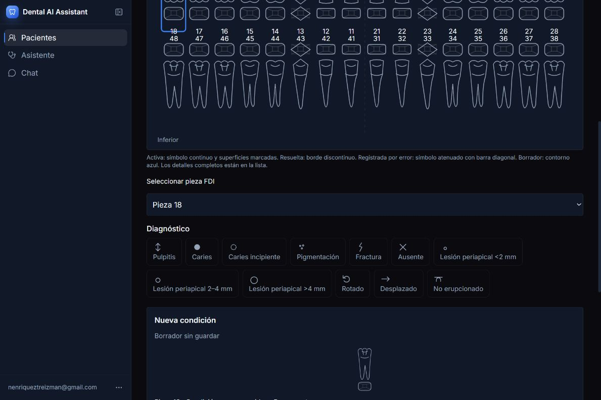

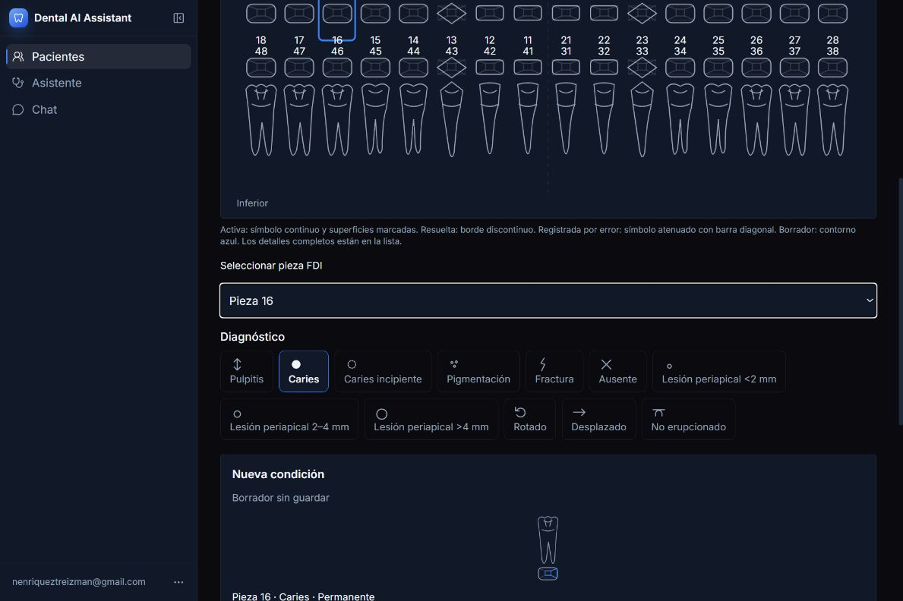

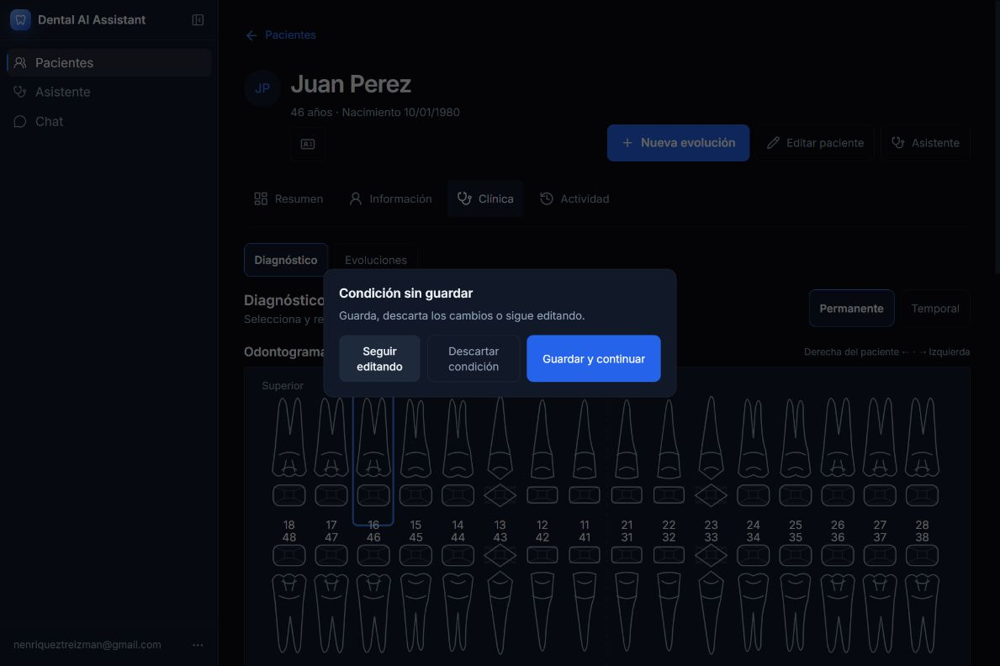

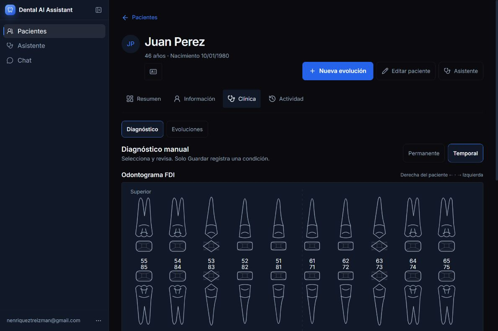

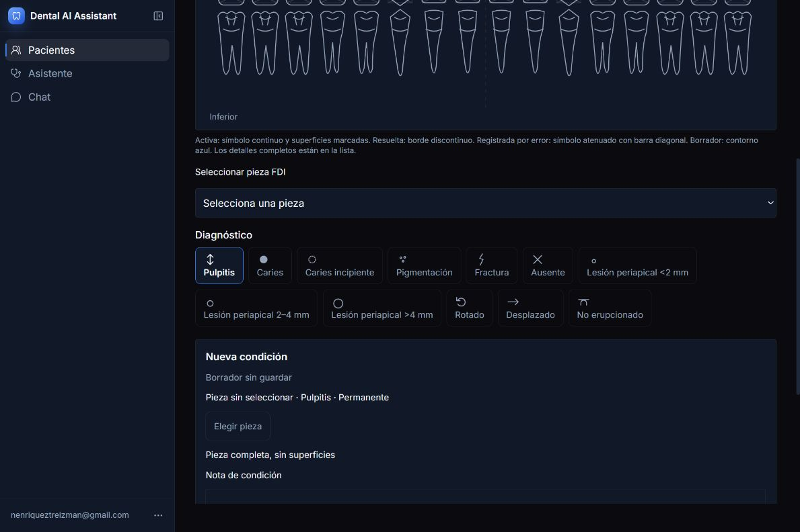

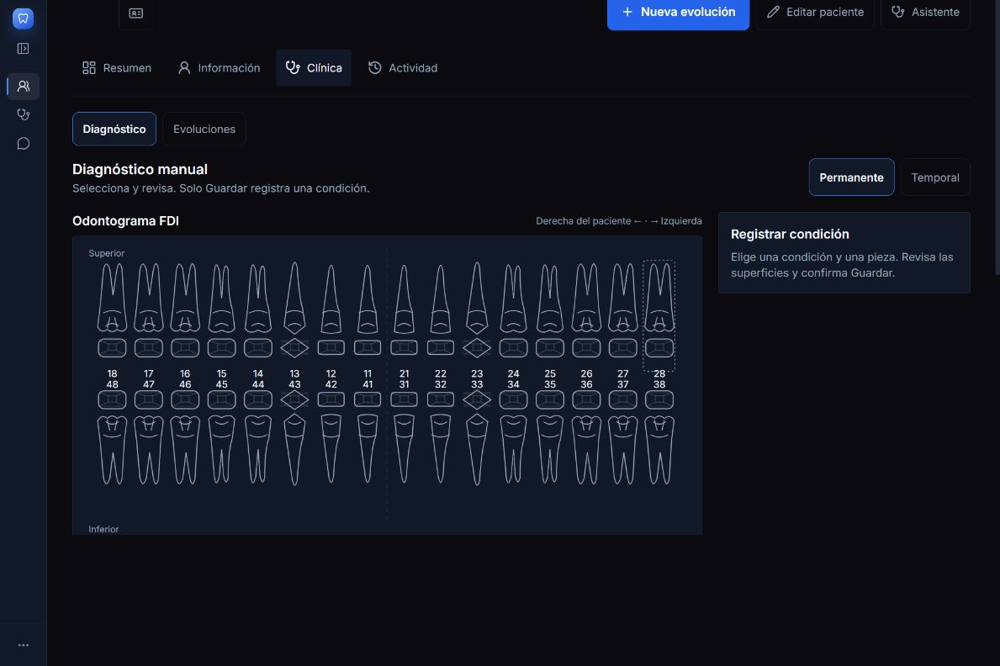
