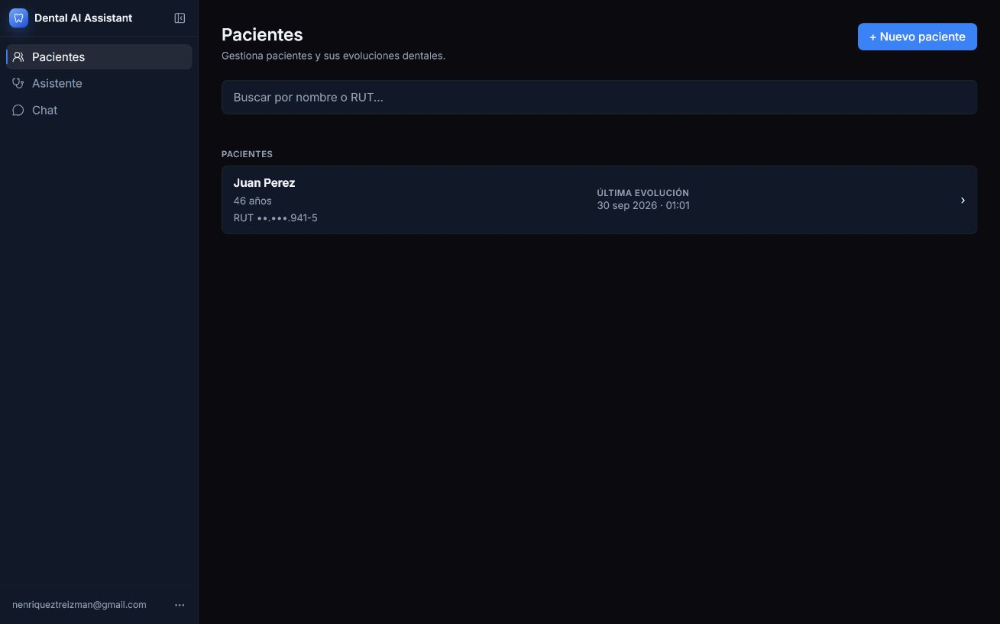
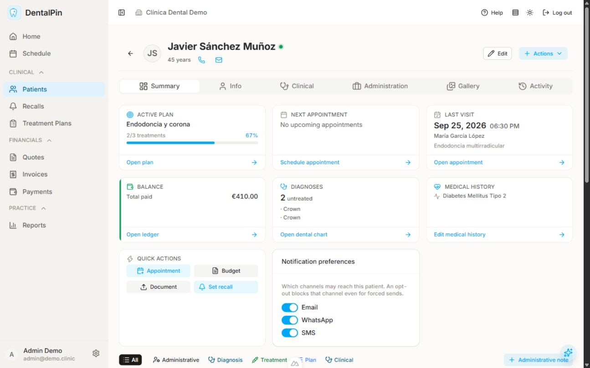
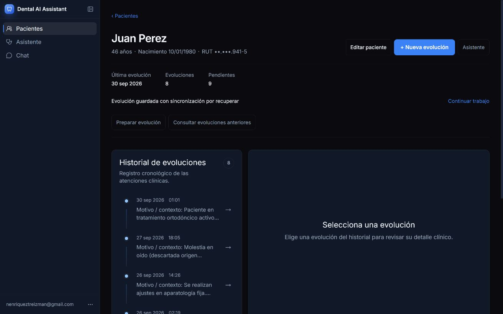
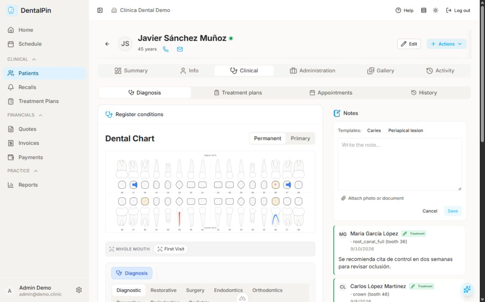
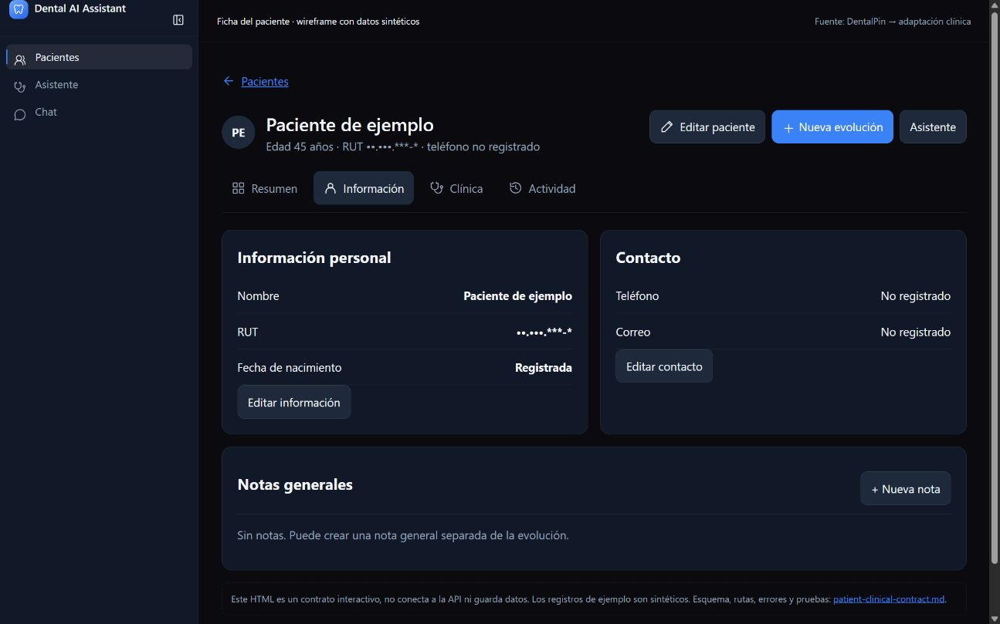

⚠️ DEGRADED: single-context (sub-agents declined by user)

# Auditoría de pacientes y revisión de la propuesta

Fecha: 2026-10-03. DentalPin se usa como referencia de composición y navegación; Dental AI Assistant conserva su identidad oscura y sus límites clínicos. El resultado es una propuesta implementable. La aplicación productiva no cambió en esta revisión.

## Método y cobertura

Se inspeccionaron capturas antes de emitir la crítica. La evaluación A quedó registrada en assessment-a.md antes de ejecutar el detector B. Se usó el navegador nativo de Codex con locators Playwright para las sesiones autenticadas. Playwright CLI tenía dos sesiones separadas: dentalpin-review estaba en about:blank y se navegó al despliegue; assistant-review se usó para verificar los HTML. El CLI no se conectó a las cookies del navegador nativo. No se extrajeron credenciales ni se copiaron datos de pacientes a la aplicación destino.

DentalPin presentó un error de memoria, registrado en08-dentalpin-runtime-error.jpg. Tras la recuperación comunicada por el usuario, se completaron15/15 fichas, cada una en Summary, Info, Clinical/Diagnosis y Activity. patient-coverage.json conserva el texto observado por sección, no un resumen inventado. El listado, alta vacía y lista para guardar, búsqueda telefónica, búsqueda sin resultado, edición cancelada, filtros de estado, cambio de orden y actividad sin resultados también se inspeccionaron. No se guardó ningún paciente, nota o condición en DentalPin ni en Dental AI Assistant. Guardado, duplicados, conflictos, persistencia y autorización necesitan pruebas durante implementación.

Target tenía un paciente visible. Se revisó su directorio, modal de alta, ficha, modal de edición y regreso al listado desde el rail compacto. La marca actual no es enlace y desaparece al colapsar, aunque los destinos compactos sí son enlaces utilizables. El nuevo comportamiento debe añadir una marca compacta separada del botón de expansión.

La medida desktop nativa real fue1309×818 CSS px, aunque se pidió1440×900. Las capturas09/10 y01 corresponden a vistas más estrechas anteriores; no compararlas como si tuvieran el mismo ancho. La captura21 es otra captura desktop, no evidencia de responsive estrecho. Playwright CLI verificó los HTML a320,713,1024 y1440 CSS px, altura900, con medidas explícitas. No se certifica accesibilidad completa, rendimiento productivo ni calidad clínica con estas capturas.

## Salud del recorrido

1. **Entrada y orientación, necesita ajuste.** DentalPin tiene banner de clínica y rail de módulos. Target ya tiene la navegación preferida. Mantenerla y enlazar la marca a Pacientes; no sumar un dashboard Home ni un banner clínico global.
2. **Encontrar un paciente, necesita ajuste.** Source combina búsqueda izquierda y controles de orden/filtro. Target ofrece nombre/RUT y ocupa todo el ancho. Adoptar el grupo compacto con nombre/teléfono/RUT, orden y filtro respaldados, sin saldos ni estados ficticios.
3. **Crear paciente, buena base.** Source usa modal centrado de dos columnas. Target ya tiene foco inicial Nombres, fecha opcional, RUT y cancelación. Extender el mismo modal con teléfono/correo opcionales y conservar sus protecciones.
4. **Seleccionar una fila, buena referencia.** Source hace toda la fila un enlace con avatar, identidad, texto secundario y chevron. Target conserva enlace real, añade columnas y reconocimiento visual. La “tabla” de DentalPin es una lista de anchors; nuestra tabla desktop debe ser semántica.
5. **Reconocer la ficha, necesita ajuste.** Source mantiene avatar, nombre, edad y acciones arriba, antes de las pestañas. Target tiene nombre/RUT/edad y acciones, pero no avatar ni secciones locales. No truncar nombres como ocurrió en la referencia estrecha.
6. **Información, buena referencia parcial.** Source ordena tarjetas médicas, personales, contacto y administración. Target incorpora solo identidad, contacto y notas generales. Edición y copiado son acciones distintas; no se agrega emergencia/facturación por inspiración.
7. **Clínica, requiere implementación nueva.** Source separa chart, herramientas, leyenda y condiciones agrupadas por diente. Nuestro diagnóstico manual tiene32/20 dientes,12 códigos en español, editor explícito y subvista Evoluciones aprobadas. No hay extracción automática de diagnósticos desde texto libre.
8. **Actividad, buena referencia parcial.** Source ofrece categorías, grupos temporales, iconos y enlaces de contexto. Target adopta Todos/Evoluciones/Notas/Diagnósticos con eventos persistidos, sin las otras categorías de DentalPin.

## Anatomía visual y medidas

| Elemento | DentalPin observado | Dental AI Assistant actual / decisión |
| --- | --- | --- |
| Navegación | Rail240, banner56; paleta clara | Rail260/56, oscuro; conservar composición actual. Marca compacta nueva en fila propia. |
| Título directorio |28px,700, alineado izquierda; alta derecha | Actual text-2xl/600; mantener escala y un solo h1. |
| Buscador |320×32, leading Search, radio6 | Actual casi ancho completo y46px alto; objetivo320–480,44px área efectiva. |
| Controles | Status, do-not-contact, deuda; Last visit y dirección aparte | Solo presencia de evoluciones, apellido/nombre/última evolución y dirección. |
| Fila |~51.6px, radio8, avatar, surname-first, phone, estado y finanzas opcionales, chevron | Tabla Paciente/Edad/Última evolución, avatar32–36, fila mínima64, ChevronRight decorativo. Contacto privado fuera del resumen del directorio. |
| Alta |512×474, radio8, pares de campos; Save inicial disabled; foco Close | Modal existente con nombres/RUT requeridos, nacimiento/teléfono/correo opcionales; foco Nombres. |
| Encabezado ficha |22px/700, avatar JS, edad, tel/mail shortcuts, Edit/Actions28px | Nombre completo, avatar44, edad y Phone/Mail/IdCard con revelado deliberado (RUT enmascarado), Editar/Nueva evolución/Asistente; acciones44 efectivas. |
| Pestañas |6 principales32px;4 clínicas |4 principales44 efectivas;2 clínicas. |
| Panel clínico | Chart y notas lado a lado en desktop; anatomía lateral/oclusal | diagnosis.html conserva geometría anatómica y reflow por ancho disponible; notas generales en Información. |
| Actividad |8 categorías, grupos de fecha, guía vertical, iconos, metadatos y chevrons |4 categorías respaldadas, guía1px, contexto exacto y20 eventos por página según contrato. |

Inter es la familia del producto target y de la referencia source. En target se usan tokens semánticos existentes para texto, superficies, bordes, foco y acento. El ring/borde source puede verse aunque computed border sea0; esa lectura no implica que deba borrarse la separación visual. No trasladar colores financieros ni tamaño28px de botones a nuestros controles.

Los criterios completos UI-01…UI-09, tolerancia de redondeo, adaptación y catálogo de iconos se encuentran en implementation-blueprint.md. Son decisiones de destino explícitas, diferentes de las medidas source. Las capturas de los bocetos no prueban API ni son una especificación de CSS para producción.

## Dentro de las 15 fichas

En todas se verificó encabezado con identidad y las cuatro secciones elegidas. La tabla siguiente resume el número mostrado por Activity. No representa resultados clínicos ni datos a migrar.

| Paciente demo | Eventos mostrados | Variante observada |
| --- | --- | --- |
| Javier Sánchez Muñoz |16 | Plan activo; sin próxima cita;8 condiciones en grupos por diente. |
| María Teresa Romero Vega |9 | Plan y próxima cita. |
| Rosa Martínez Jiménez |17 | Plan de rehabilitación y próxima cita. |
| Lucía Rodríguez Sánchez |4 | Plan sin tratamientos completados y próxima cita. |
| Antonio Hernández Castro |14 | Sin plan activo ni próxima cita. |
| Francisco García Romero |14 | Alergias visibles en encabezado; plan periodontal. |
| José Luis Muñoz Blanco |12 | Sin plan activo; saldo pendiente en source. |
| Elena Ruiz Hernández |10 | Plan activo; sin próxima cita. |
| Pablo Fernández García |8 | Plan preventivo infantil. |
| Manuel Castro Delgado |10 | Mantenimiento protésico y próxima cita. |
| Isabel López Navarro |8 | Sin plan activo. |
| Carmen Díaz Moreno |6 | Plan inicial; sin próxima cita. |
| Miguel González Torres |1 | Nunca visitado; actividad mínima. |
| David Martín López |9 | Nunca visitado; plan estético. |
| Dolores Vega Ortiz |7 | Encabezado con78años; evaluación y próxima cita. |

Las notas y datos personales completos de cada demo están en la evidencia DOM source. Los módulos médicos/administrativos/financieros observados son contexto del espejo, no nuevos requisitos. La estructura de las15 fichas es compartida; varían contenidos, estados vacíos, alertas y cantidad de actividad.

## Componentes y arquitectura

| Responsabilidad | DentalPin, rutas relativas a references/dentalpin | Dueño target |
| --- | --- | --- |
| Directorio y alta |backend/app/modules/patients/frontend/pages/patients/index.vue |Patients.tsx + PatientFormModal.tsx + typed api.ts. |
| Header y acciones |backend/app/modules/patients/frontend/components/patient/PatientStickyHeader.vue |PatientDetail.tsx y componente de dominio, dentro del shell actual. |
| Composición ficha |backend/app/modules/patients/frontend/pages/patients/[id].vue; UTabs, PersonalInfoCard, ContactInfoCard, ClinicalTab |PatientDetail/PatientOverview y componentes de pacientes. No importar el registro modular Nuxt. |
| Actividad |backend/app/modules/patient_timeline/frontend/components/patient/PatientTimeline.vue; usePatientTimeline |Nueva proyección owner-scoped en db/, ruta y cliente tipado, PatientActivity. |
| Navegación |Rail source de módulos |SidebarHeader/SidebarNavigation/Sidebar actuales. DentalToothIcon + UsersRound/Stethoscope/MessageCircle. |
| Escritura clínica |Comportamiento propio del espejo |Contratos patient-clinical-contract.md y patient-api-contract.md; Guardar único commit, revisiones y expected_revision. |

La ruta de capas se conserva: página → dominio → patrón → primitive → token. Las consultas viven en db/, fetch en api.ts, migraciones en Alembic. El nuevo registro por diente no usa el módulo de aprobación como almacenamiento implícito. El historial aprobado mantiene sus URLs exactas. La proyección de actividad consume revisiones reales, no un event bus añadido por analogía.

## Crítica y ajustes

**P1, referencia diagnóstica contradictoria.** patient-detail.html conservaba un chart genérico oculto con edición de identidad y resolución inmediata. Se retiraron esa sección y su JavaScript. Clínica abre únicamente diagnosis.html. Sugerencia aplicable: impeccable distill.

**P1, eficiencia del directorio.** La versión actual no tiene teléfono, orden, filtro ni count. UI-02…UI-04 fijan posición, columnas, enlaces, medidas y recuperación. La persistencia/contacto y búsqueda son tareas separadas de la composición. Sugerencia aplicable: impeccable layout.

**P2, shell representado incorrectamente.** Los bocetos usaban símbolos y botones encajonados diferentes al target. Se reemplazaron por los SVG reales extraídos del shell, marca, navegación y estilo actuales. Se documentó el espacio específico para marca compacta y toggle. Sugerencia aplicable: impeccable polish.

**P2, identidad y acciones inconsistentes.** UI-05/06 define nombre que puede envolver, avatar, iconos, botones y cuatro secciones. Evitar el gran panel vacío de evolución en Resumen, conservarlo en la ruta de evolución exacta. Sugerencia aplicable: impeccable clarify.

**P2, alta incompleta en el boceto.** Se añadió nacimiento opcional y agrupación de campos. UI-07 conserva las guardas y datepicker actuales; el input date del HTML solo ilustra la posición. Sugerencia aplicable: impeccable harden.

### Evaluación B y síntesis

El detector inicial emitió una advertencia side-tab en patient-detail.html:8 por la guía neutral2px del timeline. Era un falso positivo de “acento decorativo en card”, porque esa línea expresa continuidad temporal. Se dejó una guía1px según UI-08; la comprobación final de seis archivos devolvió[] y exit0. El primer intento incluyó una ruta de modal incorrecta, corregida a components/PatientFormModal.tsx antes de la evaluación completa. El wrapper devolvió exit1 con la advertencia inicial, no el2 esperado por el texto de la skill.

La evaluación manual encontró problemas que el detector no detectó: código muerto clínico, iconos de texto y diferencias de composición. La ausencia de hallazgos finales del detector no implica ausencia de deuda UX. No se inyectó un overlay: evaluate del navegador nativo es de solo lectura. Se usó CLI + DOM + screenshots como evidencia alternativa.

### Salud de diseño del target actual

| Nielsen | Puntos /4 | Motivo |
| --- | --- | --- |
| Estado visible |2 | Falta count y separación de recuperación Drive. |
| Lenguaje real |3 | Español e identidad clínica reconocible. |
| Control/libertad |3 | Back/cancel/rail; marca aún no navegable. |
| Consistencia |2 | Iconos de shell correctos, glifos y acciones dispares. |
| Prevención |3 | Guardas RUT/duplicado/descarte existentes, lectura de código. |
| Reconocimiento |2 | Sin avatar/columnas en directorio. |
| Eficiencia |2 | Rail directo, sin filtro/orden. |
| Minimalismo |2 | Título repetido y panel grande sin selección. |
| Recuperación |2 | Código conserva resultados/retry; fallo API no inducido. |
| Ayuda |2 | Labels del modal; límites de nuevas secciones requieren texto. |
| Total |23/40 |57.5%, aceptable. Valoración UX, no métrica de fiabilidad ni puntuación de los bocetos corregidos. |

Alex necesita volver al listado conservando consulta/orden/posición. Jordan necesita una marca que navegue y límites claros entre notas generales, diagnóstico manual y evolución aprobada. Sam necesita tabla semántica, foco de fila, iconos nombrados y pestañas con teclado. Estas necesidades figuran en los escenarios y pruebas de implementación. Source exige6pestañas,4subpestañas clínicas y8categorías; target reduce la carga a4/2/4. En la escritura, el punto de incertidumbre es qué se guardó: estado de borrador, acción explícita, confirmación y error sin pérdida deben acompañar el recorrido.

Questions skipped: alcance, estilo y prioridades ya fueron definidos por el usuario.

## Evidencia visual actual

Inventario de capturas:01–08 source antes de recuperación y estados de alta/búsqueda;09/10 target directorio/alta;11 source ficha recuperada;12/13 target desktop;14–18 source Info/Diagnosis/Activity y variantes;19/20 target edición/compacto;21 segunda captura target desktop;22–26 referencias sintéticas actualizadas. Las capturas22/23/24/25/26 muestran los bocetos, no funcionalidad instalada. Antes de capturar una transición hay que confirmar estado DOM; una transición animada puede mostrar selección visual momentánea distinta del contenido, como en17.

## Comprobaciones y límites

Los tres HTML se comprobaron con Playwright CLI a320/713/1024/1440×900:12 composiciones sin desbordamiento horizontal. Se confirmó Información, nota sintética→Actividad, destino Clínica→diagnosis.html, marca compacta visible→directorio y nacimiento opcional en modal, sin pageerror. Las notas del boceto solo viven en memoria. El favicon404 del servidor temporal no afecta el flujo. No se corrieron pruebas de producto/backend ni se escribieron datos reales.

No se verificaron todas las mutaciones de los15pacientes ni los módulos Administración/Galería/agenda/finanzas/comunicaciones. No se afirma que esas funciones deban trasladarse. El servidor temporal del preview se detiene al terminar y los scripts temporales se eliminan. Las tres referencias conservan su naturaleza sintética y las pruebas productivas quedan en tasks.md.

## Lectura para implementar

1. README/proposal y delta spec para alcance y comportamiento.
2. Los dos contratos de pacientes para persistencia, rutas, privacidad, conflictos y draft.
3. implementation-blueprint UI-01…09 para composición, iconos y medidas.
4. Tres HTML y capturas de este audit para referencia visual actual. Los PNG anteriores de directorio/ficha/shell quedan históricos tras este cambio.
5. tasks.md para siete slices y sus dependencias. Ningún checkbox de runtime se marca por haber revisado un prototipo.

Run notes: target slug app-frontend-src-pages-patients-tsx; sin ignore.md aplicable. A/B secuenciales en un solo contexto autorizado, no independientes. CLI detector completo y confirmación final ejecutados; navegador nativo visible, overlay no disponible, sin live-server de detector. Preview local limitado a tres HTML, cleanup al cierre. Esta auditoría agrega precisión al plan; el92/100 de readiness-review sigue siendo una valoración previa de planificación, no se convirtió en score UX ni se midió de nuevo.

## Corrección aprobada posterior a las capturas

El listado objetivo omite el RUT visible y conserva su búsqueda privada. El encabezado añade iconos de teléfono/correo presentes y RUT enmascarado con hover/foco/tap; conserva acciones y pestañas. Las capturas anteriores documentan la auditoría, no esta corrección. UI-04/UI-05 y los HTML editables contienen la referencia vigente.
