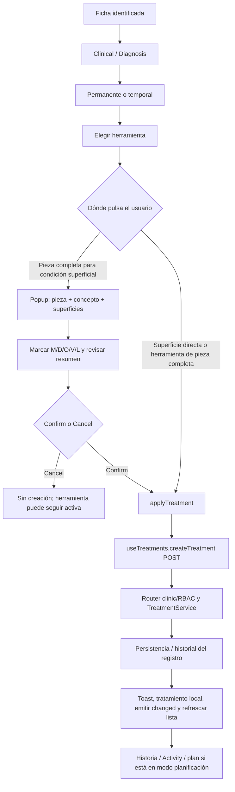
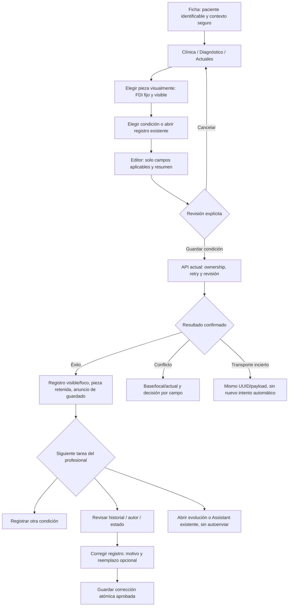

# Revisión crítica del mirror DentalPin → Dental AI Assistant

5 de octubre de 2026. Auditoría posterior de código, OpenSpec y navegador autenticado. Sin cambios de producción, escrituras clínicas, nuevas librerías ni copia de assets. Esta revisión registra recomendaciones; no modifica automáticamente el alcance aprobado ni sus requisitos.

## Veredicto

**Sí quedan gaps.** El OpenSpec define bien corrección, atomicidad, concurrencia y seis slices, pero todavía deja decisiones de interacción/representación que un implementador tendría que improvisar. La validación estricta vuelve a pasar; acredita estructura, no calidad visual ni cierre de todas las transiciones.

Hay un gap factual de compatibilidad URL que debe corregirse antes de implementar S6. Para producir el mirror profesional solicitado faltan un contrato visual de símbolos/estados, selección coordinada entre gráfico y lista, y postguardado verificable. DentalPin ayuda a cerrar algunos mediante patrones concretos. Otros no los resuelve y no deben copiarse.

«Mirror» debe significar familiaridad espacial y de flujo sobre el producto existente: misma orientación clínica, selección inequívoca, revisión y continuidad. No implica reproducir marca, colores de tratamiento, SaaS administrativo, framework Vue ni código SVG literal.

## Evidencia de esta revisión

- **CODE-VERIFIED:** ambos HEAD siguen iguales al auditado: Assistant `06b12bfaacdb23b33aa04306f617e6a22bd89e94`; DentalPin `fc36a71bdf1778d45e44ed7f72fbd0536d0be842`. Componentes, composables, rutas, servicios, design/spec/tasks y surface brief leídos.
- **BROWSER-VERIFIED:** Pin Clinical/Diagnosis, paleta Caries → pieza16 → popup0superficies/Confirm deshabilitado → O seleccionada/resumen/Confirm habilitado → Cancel → Cancel del modo aplicación. La lista continuó con8registros. Se consultó la ficha/Diagnóstico actual de Assistant sin crear draft ni guardar.
- **SOURCE-VERIFIED, no escritura en vivo:** aplicación directa, POST/createTreatment, edición/undo y refresh en DentalPin. No se pulsó Confirm/Save/Undo ni se verificó una mutación contra su DB.
- **ARTIFACT-VERIFIED:** `openspec validate harden-odontogram-human-workflow --strict` pasó nuevamente.
- **NOT VERIFIED en esta pasada:** seis viewports nuevos, guardado Pin, errores reales de transporte/undo, lector de pantalla, comparación de rendimiento, validación odontológica de símbolos. Las cifras de la auditoría anterior siguen siendo baseline, no nuevas pruebas.
- Las capturas se inspeccionaron en sesión; no se exportaron registros clínicos compartidos al repositorio. No se cambió tema, compact mode, viewport, datos o configuración de cuenta.

## Qué significa guardar un odontograma en DentalPin

En el camino revisado, el odontograma es una **proyección de registros**, no un formulario único que se guarda completo al final. Diagnóstico usa tratamientos/estados dentales persistidos individualmente. El servicio también tiene operaciones de pieza y actualizaciones agrupadas; esto no convierte el popup revisado en una aprobación de todo el examen.



**Asimetría importante:** pulsar la pieza puede abrir una revisión; pulsar una superficie directamente llama applyTreatment. El popup emite confirm y se cierra antes de esperar el resultado de createTreatment. Se observó la revisión sin guardar; esa secuencia de persistencia se leyó en código.

En planificación, crear Treatment y añadirlo al plan son llamadas secuenciales (`createTreatment`, después `addItem`), no una transacción de reemplazo clínico demostrada. No usar esta secuencia como referencia de atomicidad para la corrección aprobada de Assistant.

## Gaps pendientes y Before / After / Why

Prioridad aquí: **P1** afecta continuidad, interpretación o contrato; **P2** afecta craft/presentación. No se encontró un nuevo P0 reproducido. Cada fila es una recomendación de cierre del spec, no una implementación.

| Before | After | Why |
|---|---|---|
| **G01 · P1 · URL:** design decisión7 prescribe `clinicalView`; código y surface brief usan `clinical=evolutions`. R9 no establece compatibilidad ni precedencia. | Reutilizar `clinical=diagnosis|evolutions` como contrato canónico existente. Conservar enlaces viejos; si se mantiene un alias nuevo, definir precedencia y normalización sin borrar parámetros ajenos. | Gap factual confirmado: no conviene cambiar un Interface estable para resolver continuidad. Prueba: enlace existente de Evoluciones → reload → misma vista; ambos parámetros contradictorios deben tener resolución determinista si se admite alias. |
| **G02 · P1 · Símbolos/estados:** R4 exige texto y R6 anatomía, pero no hay matriz de los12conceptos × active/resolved/error/draft/focus. `ConditionSymbol` tiene `resolved:boolean`, no representación de error. | Catálogo visual único con símbolo, label, tamaño/trazo y tratamiento por estado; misma semántica en paleta, gráfico, editor, lista y leyenda. Estado y foco se codifican aparte del concepto. | DentalPin centraliza TreatmentIcons, constants y leyenda. Adaptar ese principio evita que una nueva condición de error parezca resuelta y que un icono de flechas se interprete como otra cosa. Requiere revisión clínica, no asumir sus colores como estándar. |
| **G03 · P1 · Final del guardado:** spec asegura persistencia/reload, pero no fija pieza enfocada, editor tras éxito, foco, siguiente acción ni refresh fallido después de un POST exitoso. | Contrato explícito `borrador → guardando → guardado confirmado → lectura actualizada` y rama `guardado confirmado / vista desactualizada`. Mantener pieza16 visible, enfocar registro guardado, anunciar resultado y permitir «Registrar otra condición» sin escribir automáticamente. | Assistant hoy anuncia éxito y reset()+load(); Pin muestra toast y despeja herramienta. Ninguno de esos detalles basta como especificación del cierre humano. Un GET posterior fallido no debe convertirse en «No se guardó» ni provocar otro POST. |
| **G04 · P1 · Selección/lista:** no se exige relación bidireccional entre la pieza del gráfico y sus filas; hover/focus/selección siguen parcialmente descritos. | Click/teclado selecciona pieza y sincroniza fila/editor; hover solo resalta. Abrir una fila enfoca su pieza, preservando guards. FDI, superficies y estado son legibles sin hover. | ConditionsList/DiagnosisMode aportan linking visual y agrupación por pieza. Hay que separar énfasis transitorio de contexto clínico confirmado. Prueba: pasar puntero por otra pieza nunca cambia draft ni vínculo de nota. |
| **G05 · P1 · Orientación móvil:** R6 dice cuadrantes paginados, pero falta orden exacto, orientación derecha/izquierda del paciente, navegación al FDI enfocado y retorno desde una fila fuera del cuadrante visible. | Especificar FDI/orientación del chart original: Q1 18→11, Q2 21→28, Q4 48→41, Q3 31→38; equivalentes temporales. Nombrar cuadrantes por lado del paciente. Focus/deep link abre cuadrante correcto sin mutar selección. | DentalPin aporta anatomía lateral+oclusal y simetría; no resuelve por sí solo el tamaño táctil. Recortar/reordenar por numeración ascendente puede romper continuidad anatómica. Mantener lista de hechos visible: cambiar vista no filtra silenciosamente condiciones. |
| **G06 · P2 · Resumen/lista:** hay estado/filtro, pero no definición visual de una fila con varias condiciones y sus acciones, ni unidad del contador. | Grupo compacto «Pieza16» con condiciones individuales, superficies y status; acciones a nivel de registro con nombres explícitos. Si se muestra conteo, distinguir «condiciones» de «piezas» y contar solo datos completos/confirmados. | Pin agrupa ocho registros en menos filas de pieza; el badge8 no equivale a ocho dientes. Agrupar con proximidad/separador es más claro que una card por condición. Varias condiciones necesitan edit targets distintos. |
| **G07 · P2 · Cards/iconos/marca:** identidad oscura preservada, pero S4 permite distintas implementaciones sin criterios de proporciones, agrupación, leyenda y acciones auxiliares. | Un área de trabajo dental, inspector solo cuando cabe y lista agrupada; semántica de superficie antes que nuevas cards. Iconos de navegación del sistema; símbolos dentales propios; badges textuales discretos. Conservar el logo Assistant. | Pin demuestra familias consistentes y una jerarquía reconocible, pero a ancho estrecho su rail de notas comprime mucho el gráfico y usa varios contenedores. Copiar su composición literal reproduciría el problema auditado. |
| **G08 · P1 · Spec visual verificable:** seis tamaños y44px están definidos; no hay referencia visual específica del resultado corregido, conflicto, error y postguardado, ni layout con panel Assistant abierto. | Añadir matriz de estados/casos y una referencia visual acotada para desktop, ancho medio y móvil, con paciente sintético. Verificar ancho de contenedor real con Assistant abierto/cerrado, foco/cancel y al menos1280/1024/390. | El viewport no equivale al ancho disponible. El audit anterior ya mostró esa falla. No hace falta otro rediseño ni tres nuevas alternativas: hace falta una referencia de la dirección aprobada y pruebas que detecten regresión. |
| **G09 · P1 · Alcance de «Guardar»:** no hay un requisito que explique si se guardan uno o todos los hallazgos/examen completo. | Mantener guardado por registro del alcance actual y usar «Guardar condición»/«Guardar corrección». El odontograma se actualiza como proyección. Si se desea «Finalizar examen», preparar otro contrato con fecha, autor y cobertura revisada. | DentalPin no demuestra una aprobación única de examen en el recorrido revisado. No introducir un botón global que solo guarde el último draft o sugiera examen completo. Crear un snapshot global no está incluido en la aprobación anterior. |

### Ubicación y cobertura de los gaps

- G01: `design.md` decisión7; R9; S6. Factual y resoluble desde código.
- G02: decisiones4–5; R4/R6; S3/S4. Necesita catálogo visual y aceptación; no nuevos códigos clínicos.
- G03: decisiones1/5; R1/R7/R10; S2/S4 + integración. El cierre postguardado debe cubrir create/edit/resolve/correct y transporte.
- G04–G05: decisión5; R6; S4. Linking y orden de cuadrantes son refinamientos del flujo existente.
- G06–G07: R4–R7; S3/S4; `.impeccable/surfaces/patient-workspace.md`. Composición localizada, no nueva arquitectura.
- G08: R10 y tareas3.2–3.8. Referencia sintética futura; el audit no generó un prototipo.
- G09: proposal Out Of Scope/R12. Explicitación del contrato actual; examen global sería otra decisión de producto.

## Qué copiar conceptualmente y qué evitar

| Referencia DentalPin | Adaptación Assistant | Evitar |
|---|---|---|
| SurfaceSelectorPopup: pieza/concepto, preview, selección y resumen | Editor compacto con labels nativos, surfaces y resumen claro antes de Save | Popup que cierra antes del resultado o botones sin estado ARIA. |
| ToothDualView + paths anatómicos | Claridad espacial y familias originales existentes | Copiar un SVG grande sin targets/teclado o texto minúsculo a ancho medio. |
| TreatmentIcons + constants + legend | Una fuente semántica para12conceptos y sus representaciones | Duplicar reglas/iconos por pantalla o imponer su paleta como convención clínica validada. |
| ConditionsList agrupado por pieza | Una cabecera FDI por grupo, filas individuales con acciones claras | Conteo ambiguo, ocultar hechos por defecto o confundir treatment realizado con diagnóstico. |
| Edit modal conserva cambios al fallar update | Mantener draft y confirmar resultado en misma región | Cerrar siempre tras Save, perder nota o mostrar éxito sin confirmar backend. |
| HistoryMode solo lectura y fecha clara | Historial de condición/revisión, estado/autor/razón/enlaces | Copiar replay global como si ya existiese ni usar Completed para Pulpitis. |
| DiagnosisCTA propone siguiente paso | Tras guardar, CTA secundaria hacia evolución/Assistant existente | Crear plan o presupuesto dentro de este cambio, o enviar prompt automáticamente. |
| SegmentedControl y badges | Secciones clínicas actuales y status etiquetados | Añadir appointments/plans a la ficha sin sus dominios. |

## Problemas de DentalPin que el mirror no debe heredar

1. **Hover puede cambiar contexto de nota.** `DiagnosisMode.handleToothHover` escribe selectedTooth, y sidebarCtx lo pasa al compositor. En sesión se vieron distintos destinos de «Attach to tooth» al recorrer el chart/herramienta, sin guardado. Esto es contexto transitorio en UI, no un error de persistencia demostrado. En Assistant, hover/focus no debe cambiar el FDI confirmado ni vincular una nota automáticamente.
2. **Confirm cierra sin esperar create.** SurfaceSelectorPopup.handleConfirm emite y cierra; OdontogramChart.handleSurfaceConfirm llama applyTreatment sin await. El código no deja ese popup disponible para corregir un fallo del POST. No se reprodujo fallo de red allí.
3. **Undo puede anunciar éxito aunque falle delete.** handleUndo hace pop, await deleteTreatment y toast Undone; deleteTreatment devuelve boolean false en catch. No se comprueba el boolean antes de anunciar. CODE-VERIFIED; fallo real NOT VERIFIED. Assistant debe usar la corrección aprobada, no un Undo clínico aparente.
4. **Vaciar superficies no se envía en edit.** TreatmentEditModal.handleSave solo incluye superficies cambiadas si length>0. No transportar esto al contrato Assistant, que actualmente admite[] según código. Si Pin exige una superficie, debe comunicarlo; no inferir que quitar todas produjo un update.
5. **Diagnóstico y plan comparten Treatment/performed.** Es el adaptador previsto, no un fallo de status técnico; puede inducir «Completed Pulpitis». Conservar semántica propia de condición activa/resuelta/error.
6. **Cards/rail no garantizan jerarquía.** En la ventana nativa observada, card+rail de notas reduce la legibilidad del chart y acciones flotantes compiten por espacio inferior. No es una nueva validación390px. Usar container width y preservar tamaño legible antes de fijar300px de inspector.

## Flujo objetivo aplicable sin expandir el producto



Guardar registro y regenerar la proyección son pasos distintos. Si POST tuvo éxito y GET falla: «Condición guardada; no pudimos actualizar la vista», con Retry de lectura. Si el POST queda incierto: no anunciar guardado ni fracaso definitivo; conservar intento congelado. Resolver sigue significando resultado clínico; corregir señala error de registro.

## Brief visual profesional

```text
Paciente y contexto seguro
Clínica > Diagnóstico                         [Actuales / Histórico]

Odontograma        [Permanente / Temporal]    Inspector cuando cabe
orientación/FDI claros                        Pieza16 · Caries
selección separada de hover                   [superficies pertinentes]
leyenda breve visible                        nota
                                             Cancelar  Guardar condición

Condiciones por pieza
16   símbolo + Caries · O       [Activa]      Editar / Historial
     otro registro             [Estado]      acciones por registro

Confirmación local y siguiente acción, sin confundirla con Drive
```

- **Marca:** conservar logo dental e identidad Assistant en shell. No repetir logo dentro de cada panel, editor o fila. DentalPin sirve como referencia de consistencia, no como marca compartida.
- **Iconos:** misma familia para acciones,20px habituales y trazo consistente; nombre accesible. Símbolo clínico no sustituye label ni reproduce un icono administrativo genérico.
- **Badges/stickers:** Activa, Resuelta y Registrada por error con texto; Borrador/Guardando pertenecen a feedback temporal, no a diagnóstico. No crear una colección de stickers decorativos ni colorear cada fila completa.
- **Cards:** una superficie para área de trabajo si define un límite real; lista con proximidad y separadores sutiles. No card por cada superficie o dato. Inspector oscuro tonal, sin shadow permanente. Shadow solo para overlay flotante.
- **Color:** azul para selección/acción primaria; foco independiente. Error de red, error de registro y diagnóstico no deben compartir significado solo por ser rojos. Mapear estados con texturas/texto y tokens, no afirmar un estándar dental inexistente.
- **Densidad:** FDI tabular, label clínica legible, nota en ancho útil. No arreglar compresión bajando tipografía. Una acción dominante por región; «Nueva evolución» global y Guardar local tienen contexto distinto.
- **Mobile:** preview útil compacto, pieza siempre identificable, controles44px, campos16px; sin copiar FAB/rail que oculte composer/editor o mantener un chart32piezas minúsculo. Lista clínica permanece explícita.
- **Motion:** feedback inmediato y estados pending/saved; ninguna animación decorativa al elegir pieza o tecla. Overlay breve si ya existe patrón y reduced motion; guardar no espera animación.

## Fuentes de código verificadas

DentalPin base: `C:/Users/nenri/OneDrive/Desktop/proyectos/pry-ai-evaluator/references/dentalpin/`.

| Archivo relativo | Símbolo/patrón útil |
|---|---|
| `backend/app/modules/odontogram/frontend/components/odontogram/OdontogramChart.vue` | handleToothClick, handleSurfaceClick, applyTreatment, handleSurfaceConfirm, handleUndo, handleTreatmentUpdate |
| Misma carpeta: `SurfaceSelectorPopup.vue` | handleConfirm/Cancel, preview, contador/resumen |
| Misma carpeta: `TreatmentIcons.ts`, `TreatmentBar.vue`, `OdontogramLegend.vue` | catálogo, paleta y leyenda |
| Misma carpeta: `ToothDualView.vue`, `TreatmentEditModal.vue` | anatomía y cambios de editor |
| `backend/app/modules/odontogram/frontend/components/clinical/DiagnosisMode.vue` | condiciones, sidebarCtx y hover binding |
| Misma carpeta clinical: `ConditionsList.vue`, `DiagnosisCTA.vue`, `HistoryMode.vue`, `ClinicalModeToggle.vue` | grouping, siguiente paso, historia y modos |
| `backend/app/modules/odontogram/frontend/composables/useTreatments.ts` | status adapter, POST/PUT/DELETE, null/false en failure |
| `backend/app/modules/odontogram/router.py`, `service.py` | límites clinic/RBAC y persistencia por recurso |

Assistant: `app/frontend/src/pages/PatientDetail.tsx` lee `clinical`; `components/patients/PatientDiagnosis.tsx` save/reset/load; `ConditionSymbol.tsx` símbolo/resolved; `PatientOdontogram.tsx` overview/overlays; `.impeccable/surfaces/patient-workspace.md` establece navegación y lenguaje visual.

El archivo LICENSE de DentalPin declara Business Source License1.1 y restricciones propias. Esta auditoría no autoriza ni hace una copia de código/assets; la dirección propuesta adapta patrones y mantiene geometría/marca originales de Assistant. Una reutilización literal requiere revisar ese archivo y los derechos concretos, sin asumir licencia MIT.

## Qué faltaba para cerrar el OpenSpec (evaluación previa al cierre)

1. Corregir compatibilidad del query existente G01 y agregar sus escenarios a S6.
2. Incorporar catálogo visual y estados G02, linking/orientación G04–G05 y fila/contador G06 sin añadir taxonomía.
3. Especificar postguardado G03 y unidad de commit G09 para las cuatro operaciones, con feedback de refresh vs write.
4. Añadir referencia sintética y matriz de estados/layouts G07–G08 a las slices existentes, no un rediseño aparte.
5. Revalidar requisitos/design/tasks y revisar readiness humana/visual, separando validación OpenSpec de proof runtime.

La pasada anterior marcó Implementation Ready para el conjunto acotado, pero esta revisión detecta un contrato URL incompleto y detalle visual insuficiente para el mirror ahora solicitado. **Estado recomendado: in-progress para cierre de estos gaps**, sin reabrir las decisiones humanas D-01/D-02. Las tools, examen global, procedimientos/planes, perfil profesional y cambios clínicos diferidos continúan fuera de alcance.

## Cinco cierres de mayor valor

1. Selección anatómica clara y coordinada con lista/editor, sin hover que cambie contexto.
2. Un catálogo visual coherente para concepto, estado y foco, conservando labels clínicos.
3. Guardar/reintentar/cancelar y postguardado completamente especificados, con pieza retenida y lectura fallida diferenciada.
4. Compatibilidad URL y layout por ancho disponible, incluyendo panel Assistant abierto.
5. Referencia visual sintética de desktop/móvil y estados críticos que guíe implementación y regresión.

La mayor mejora de calidad vendrá de estas relaciones consistentes. Logos adicionales, más cards y stickers decorativos no sustituyen un flujo clínico comprensible.

## Specification closure, 2026-10-05

The previous in-progress assessment above is historical. G01–G09 are now closed at specification level, not delivered in production. Human decisions D-01/D-02 and deferred scope remain unchanged.

| Gap | Normative closure | Future proof ownership |
|---|---|---|
| G01 | R9/R15 and design decision7 preserve clinical query and path precedence | S6 existing links, reload and dirty guards |
| G02 | R14; visual-contract catalog/status/draft/focus matrix | S3/S4 symbol and text-state checks |
| G03 | R13; visual-contract post-save matrix for all four commands | S2/S4 confirmed write, failed read, uncertain response and exact result focus |
| G04 | R15; deliberate chart/list activation, highlight-only hover | S4 record selection and draft guard |
| G05 | R15; anatomical order and retained selected piece | S4 every permanent/primary quadrant |
| G06 | R14; grouped FDI, separate records, explicit count units | S3 complete/incomplete paging and row actions |
| G07 | R14; incumbent identity, original glyphs and restrained grouping | S3/S4 rendered hierarchy review |
| G08 | R15; isolated reference and viewport/state matrix | S4 six sizes, actual Assistant open/closed; integrated manual accessibility |
| G09 | R13; individual record commits, no examination-save claim | S2/S4 all command postconditions |

The isolated HTML was checked with installed Playwright/Chromium in96 cases:60 state/viewport combinations,30 desktop panel-open compositions and6 short-name/primary-quadrant fixtures. No horizontal overflow or JavaScript errors; visible button bounds meet44px and textarea font is16px in this reference. Screenshots were visually reviewed. Mobile editor precedes long saved-record text, keeping all clinical information visible. These measurements do not prove production touch targets, clinical persistence, screen-reader or virtual-keyboard behavior.